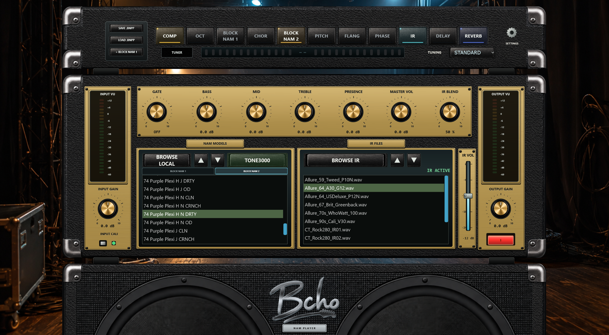

# Bcho NAM Player 1.6.0

[English](README.md) | [Última release](https://github.com/bchosoft/Bcho_NAM_Player/releases/latest) | [Manual en español](docs/USER_MANUAL.es.md)



Bcho NAM Player es un procesador de guitarra standalone y portable para Windows, macOS y Linux. Combina Neural Amp Modeler, respuestas impulsionales, rack de efectos reordenable, calibración automática, afinador DI, presets portables, enrutamiento flexible y una interfaz fotorrealista responsive.

## Novedades de la versión 1.6.0

- Las ventanas Settings y Audio I/O escalan proporcionalmente al área disponible, incluidos controles, márgenes y tipografía, para que las secciones inferiores de routing y calibración sigan visibles en portátiles de 1366 x 768.
- Frontal completamente rediseñado sobre una cuadrícula nativa de 1537 x 1023.
- Controles y textos proporcionales al tamaño de la ventana, con mínimo del 50 por ciento.
- Navegadores NAM e IR separados y más grandes, con cuatro filas, scroll y flechas.
- Vúmetros digitales LED simétricos y rack/afinador más limpio.
- Movimiento visual de los conos según el nivel final real de salida. Solo afecta a la imagen, nunca al sonido.
- Once skins con geometría idéntica y nombres ingleses: Astra / Obsidian, Tribal / Etched Titanium, Skulls / Bone & Carbon, Hippie / Sunset Paisley, Graffiti / Electric Ink, Purple Velvet / Amethyst, Stainless Steel / Precision, Ripped Black Denim / Roadworn, Blue Denim / Indigo, Spiderwebs / Black Widow y Classic Black / Levant Tolex.
- Placas de material visto coordinadas, marcos de pantalla, esquineras metálicas y pies inferiores del rack conservan el apilado físico del rack, el head y la cabina.
- Fader vertical independiente de volumen de cabina IR con escala dB alineada, fondo de backstage de escenario de rock a pantalla completa y acabados de controles propios de cada skin.
- Logotipo Bcho de la cabina con acabado de acero inoxidable pulido.
- Restauración inicial y cambios de NAM/IR con suavizado antirruido.

## Descarga

La [última release](https://github.com/bchosoft/Bcho_NAM_Player/releases/latest) contiene:

- `BchoNAMPlayer-v1.6.0-Windows-x64.zip`
- `BchoNAMPlayer-v1.6.0-macOS-arm64.zip`
- `BchoNAMPlayer-v1.6.0-macOS-x86_64.zip`
- `BchoNAMPlayer-v1.6.0-Linux-x86_64.zip`
- Manuales PDF en español e inglés.
- `SHA256SUMS.txt` para verificar la integridad.

Cada ZIP es autocontenido. Conserva juntos todos sus archivos y carpetas. Se incluyen dos modelos NAM de demostración en `Models`; no se incluye ninguna IR, por lo que el bloque IR comienza en bypass.

## Funciones principales

- Detección automática de NAM A1, A2 Standard y A2 Nano.
- Dos espacios genéricos e independientes, **BLOCK NAM 1** y **BLOCK NAM 2**, cada uno compatible con cualquier modelo `.nam`.
- Bloques COMP, OCT, PITCH, BLOCK NAM 1, CHOR, FLANG, PHASE, DELAY y REVERB reordenables alrededor de los anclajes BLOCK NAM 2 e IR.
- Tres tipos y seis parámetros avanzados por cada efecto convencional.
- Carga de archivo, carpeta y drag-and-drop para ambos bloques NAM e IR.
- Mensajes claros **NAM file not found** e **IR not found**.
- Navegador de modelos TONE3000.
- Convolución IR sin normalización; al pulsar de nuevo la IR seleccionada se deselecciona.
- Gate profesional, Bass, Mid, Treble, Presence, Master Volume, IR Blend y volumen independiente de la cabina IR.
- Afinador estable sobre DI intacta y afinaciones alternativas.
- Rutas MAIN, PRE, DI y WET.
- Presets `.bnpp` autocontenidos con recursos y hashes verificados.
- Bypass con un clic y edición/carga diferenciada mediante doble clic.

## Instalación rápida

### Windows

Descomprime el ZIP de Windows en una carpeta con permisos de escritura y ejecuta `BchoNAMPlayer.exe`. Abre la rueda dentada, elige **AUDIO SETUP** y selecciona ASIO/WASAPI, interfaz, canales activos, frecuencia, buffer y ruta de salida. Instala el driver ASIO oficial cuando exista.

### macOS

Elige el ZIP Apple Silicon (`arm64`) o Intel (`x86_64`), descomprímelo y abre `BchoNAMPlayer.app`. La app tiene firma ad-hoc pero no está notarizada. En el primer inicio, haz clic derecho y selecciona **Abrir** si Gatekeeper solicita confirmación.

### Linux

Descomprime el ZIP y ejecuta el AppImage x86_64. Si fuera necesario:

```bash
chmod +x BchoNAMPlayer-*.AppImage
./BchoNAMPlayer-*.AppImage
```

## Carga de NAM e IR

**BROWSE LOCAL** acepta un `.nam` o una carpeta para la pestaña NAM activa. BLOCK NAM 1 y BLOCK NAM 2 conservan carpetas, listas y selecciones independientes. La opción **DEEP SEARCH** incluye subcarpetas y aparece desactivada cada vez que se abre el navegador. Al elegir una carpeta se carga automáticamente el primer modelo. **BROWSE IR** acepta una respuesta `.wav` adecuada o una carpeta. El drag-and-drop funciona sobre ambas pestañas/listas NAM y sobre los bloques BLOCK NAM 1, BLOCK NAM 2 e IR.

Los cambios de NAM e IR usan fades para evitar clics. Las IR se adaptan a la frecuencia del dispositivo sin normalizar su ganancia original. El fader vertical **IR Cabinet Volume** ofrece una ganancia independiente de la cabina húmeda entre -24 dB y 0 dB antes de IR Blend y comienza en -12 dB. Al pulsar de nuevo la IR activa se elimina la selección y el bloque queda en bypass.

## Input Cali

Configura la referencia de la interfaz en **Settings > Audio Setup > Interface Input Reference / 0 dBFS Peak**. Input Cali resta la referencia de entrada del NAM a la de la interfaz. Prefiere el metadato `input_level_dbu` y, si no existe, presupone +12 dBu; la corrección se limita a -24/+24 dB. Para una PreSonus Studio 24c se utilizará +10 dBu. Un LED verde indica que la calibración está activa.

## Rack, presets y ajustes

Arrastra los bloques para colocar efectos delante del ampli, en el loop/pre-IR o después de la cabina. Un clic cambia el bypass; un doble clic abre el editor o cargador sin provocar una falsa conmutación.

**SAVE .BNPP** guarda los modelos de ambos bloques NAM, la IR opcional, orden, algoritmos, bypasses y controles en un solo archivo portable. El dispositivo de audio permanece local al ordenador.

La rueda dentada contiene Audio Setup, previsualización/aplicación de skins, versión y comprobación manual o automática de actualizaciones. Una skin solo queda fijada al pulsar **APPLY SKIN**.

Consulta el [manual completo en español](docs/USER_MANUAL.es.md), el [manual en inglés](docs/USER_MANUAL.en.md) y los [avisos de terceros](THIRD_PARTY_NOTICES.md).

El repositorio público distribuye únicamente documentación y paquetes compilados. El código fuente permanece en el repositorio privado de desarrollo.
