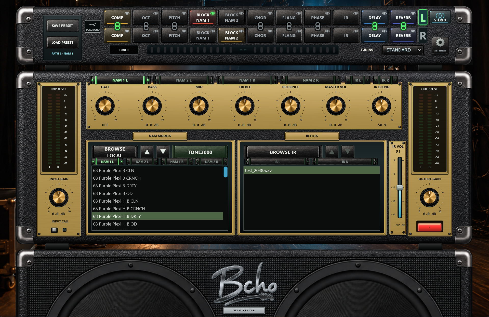

# Bcho NAM Player 1.7.5

[English](README.md#english) · [Descargas](https://github.com/bchosoft/Bcho_NAM_Player/releases/tag/v1.7.5) · [Apoya el proyecto en Ko-fi](https://ko-fi.com/bchosoft)

## Descripción general

Bcho NAM Player es un procesador de guitarra construido alrededor de capturas **Neural Amp Modeler**, **respuestas impulsionales** de pantalla y un rack de efectos de estudio. Está disponible como **aplicación standalone** portable y como **plugin** de efecto de audio (VST3 en Windows, macOS y Linux, y AU en macOS).

Tiene **dos rutas de señal completas e independientes, L y R**. Cada ruta tiene su propio BLOCK NAM 1, BLOCK NAM 2, IR de pantalla, rack de ocho efectos con orden libre, puerta de ruido, sección de tonos, volumen máster, IR blend, volumen de pantalla, **ganancia de entrada**, ganancia de salida, encendido, calibración de entrada y afinador. En **MONO** suena una ruta; en **STEREO** funcionan las dos a la vez.

## Novedades de la 1.7.5

- **Las sesiones del DAW se restauran de verdad.** Al reabrir un proyecto, los NAM, NAM de pedal e IR guardados de **las dos** rutas vuelven a cargarse en el motor de audio —no solo sus nombres en las listas— con el estado activado/desactivado exacto de cada bloque. Funciona sea cual sea el orden en que el DAW restaura el estado y prepara el audio, y con el editor cerrado.
- **Sin chasquidos ni ruido.** El arranque, la restauración de sesión, cargar o sustituir un NAM, cargar un NAM de pedal, preparar o reinicializar el audio y los cambios de frecuencia de muestreo o de tamaño de búfer entran con fundido desde silencio. Al pasar de un NAM a otro, la cadena hace fundido de salida, instala la captura nueva (ya precalentada) y vuelve con fundido de entrada, así que la onda nunca se corta.
- **Salida del plugin siempre estéreo.** En una pista mono en STEREO, las dos cadenas reciben la misma entrada, así que una guitarra mueve dos equipos; L alimenta la salida izquierda y R la derecha. INPUT GAIN es independiente para L y R.
- **Enlaces de efectos L/R.** En STEREO, un icono de cadena enlaza un efecto de L con el mismo efecto de R: una edición cambia ambos, y cada bloque conserva su interruptor y su posición.
- **Selector de visualización con el ojo.** El cuerpo del bloque lo activa o lo pone en bypass; el ojo de cada bloque elige qué bloque describen los controles compartidos y los navegadores. Un bloque desactivado no se puede visualizar.
- **Biblioteca TONE3000 más rápida y completa.** Seleccionar un tone lo carga al instante en el bloque NAM actual (alrededor de un segundo hasta que suena; inmediato si ya lo habías descargado). **RESTORE PREVIOUS MODEL** devuelve la captura que tenía el bloque antes. Las capturas A2 ya se cargan desde todas las listas, los tones que solo tienen IR se marcan, y el buscador del catálogo completo se cierra solo al elegir un tone.
- **Cierre limpio en los DAW.** Cerrar un proyecto que contiene el plugin ya no deja el proceso del DAW en marcha.
- **Apoya el proyecto** desde la ventana de ajustes: **[ko-fi.com/bchosoft](https://ko-fi.com/bchosoft)**.
- **Manuales reescritos**, en inglés y español, con cada control documentado y capturas de pantalla.

## Compatibilidad

| Plataforma | Standalone | Plugin |
| --- | --- | --- |
| Windows 10/11 x64 | `.exe` portable (ASIO, Windows Audio, DirectSound) | VST3 |
| macOS 11+ Apple Silicon (`arm64`) | `.app` | VST3 y AU |
| macOS 11+ Intel (`x86_64`) | `.app` | VST3 y AU |
| Linux x86_64 | AppImage | VST3 |

Usa el paquete de plugin que coincida con la arquitectura de tu DAW. No se incluye AAX. Las versiones de macOS tienen firma ad-hoc y no están notarizadas por Apple.

## Standalone

- Su propio **Audio Setup**: driver (incluido ASIO en Windows), interfaz, canales activos, frecuencia de muestreo y tamaño de búfer.
- **Cuatro rutas a salidas físicas**: MAIN (sonido final), PRE (BLOCK NAM 2 antes de tonos, efectos y pantalla), DI (entrada sin tocar) y WET (después de la pantalla).
- **DUAL MONO / SPLIT L/R** en STEREO: una guitarra a las dos cadenas, o entrada 1 a L y entrada 2 a R. Los selectores de ruta L/R están a la derecha de las dos filas del rack, sin solaparse con el conmutador de entrada.
- **Recuerda la última sesión** al cerrar con normalidad: las dos rutas, capturas, IR, orden de bloques, bypass, enlaces, acabado, dispositivo y ruteo. El primer arranque es seguro: MONO y sin nada cargado.
- **Input Cali**: calibración automática a partir de la referencia en dBu de tu interfaz y de los metadatos `input_level_dbu` de la captura.
- Once acabados del panel frontal, conos animados que siguen el nivel real de salida y comprobación de actualizaciones.

## Plugin VST3 / AU

- Efecto de audio con **salida estéreo en pistas mono y estéreo**. MONO copia la ruta izquierda a las dos salidas; STEREO envía L a la salida izquierda y R a la derecha.
- El proyecto del DAW guarda las dos rutas, todos los controles, las referencias a archivos, el orden del rack, algoritmos, parámetros, bypass y enlaces L/R. Las sesiones se restauran en el motor como se describe arriba.
- Parámetros automatizables por ruta: ganancia de entrada, puerta, tonos (principales y de NAM 1), máster, IR blend, volumen de pantalla, ganancia de salida, encendido, calibración de entrada y afinador, además del conmutador global MONO/STEREO.
- Usa el dispositivo de audio del DAW; siempre con el acabado Astra / Obsidian.

## Capturas, NAM de pedal e IR

- **BLOCK NAM 2** (amplificador) y **BLOCK NAM 1** (pedal o previo) por ruta, cada uno con su carpeta, su lista y su opción de búsqueda profunda. NAM A1, A2 Standard y A2 Nano se detectan automáticamente. BLOCK NAM 1 tiene sus propios BASS / MID / TREBLE / PRESENCE.
- Carga desde **BROWSE LOCAL**, la lista, **TONE3000**, doble clic en el bloque, o arrastrando y soltando sobre la lista o el bloque.
- Las **IR de pantalla** (`.wav`, mono o estéreo, hasta 8192 muestras) se remuestrean a la frecuencia del dispositivo y **nunca se normalizan**. **IR BLEND** mezcla seco y pantalla; **IR VOL** ajusta la rama de pantalla de -24 a 0 dB (por defecto -12 dB).
- Pasa el ratón por un bloque NAM o una fila de la lista para ver la **ficha de la captura**: metadatos y carátula.

## Rack y efectos

Once bloques por ruta en orden de proceso, reordenables libremente alrededor de las anclas BLOCK NAM 2 e IR. **Clic en el cuerpo del bloque para activarlo o ponerlo en bypass; clic en el ojo para visualizarlo; doble clic para abrir su editor o su selector de archivo.** Compresor, octavador, transpositor, chorus, flanger, phaser, delay y reverb, cada uno con **tres algoritmos y seis parámetros en unidades reales**; los cambios se suavizan y la realimentación está acotada.

## Presets portables `.bnpp`

Un preset incrusta sus capturas e IR (verificadas con SHA-256) junto con el orden del rack, algoritmos, parámetros, bypass y controles. Los presets del standalone contienen las dos rutas y los enlaces L/R; los del plugin, la ruta seleccionada. El dispositivo de audio y el ruteo quedan fuera a propósito, para que los presets viajen entre ordenadores.

## TONE3000 y WebView2

Conecta tu cuenta de TONE3000 una vez; el reproductor guarda un token de refresco cifrado y no vuelve a necesitar un navegador en ese ordenador. Navega por **TRENDING, LATEST, FAVOURITES, DOWNLOADED y MINE**, preescucha seleccionando, o abre **SEARCH FULL CATALOGUE**. En Windows las páginas integradas usan **Microsoft WebView2**, que se detecta directamente (también dentro de los DAW, con una carpeta de datos por usuario con permisos de escritura). Si falta, puedes abrir la página oficial de descarga de Microsoft, usar tu navegador externo o cancelar: **nunca se instala nada automáticamente**, y el audio local no necesita WebView2. macOS usa WKWebView; Linux, el navegador del sistema.

<table><tr><td bgcolor="#fff3cd">
<strong>IMPORTANTE — elige conscientemente la variante del navegador</strong> 
<strong>¿Qué es WebView2?</strong> Es el componente web de Microsoft que permite mostrar las páginas de TONE3000 dentro de la aplicación. En Windows 11 viene instalado por defecto; en Windows 10 normalmente se instala mediante las actualizaciones de Windows o junto con Microsoft Edge. Si Edge está instalado y actualizado, WebView2 suele estar disponible.  
<strong>EmbeddedBrowser</strong> muestra TONE3000 dentro de la aplicación y es la descarga recomendada cuando WebView2 está disponible.  
<strong>ExternalBrowser</strong> no utiliza un WebView integrado. Abre TONE3000 en tu navegador habitual del sistema y es la alternativa para equipos donde WebView2 no está disponible o si prefieres no usar un navegador embebido. macOS utiliza el WKWebView de Apple, integrado en el sistema, y Linux el navegador del sistema; WebView2 solo es relevante en Windows. Las dos variantes tienen el mismo motor de audio.
</td></tr></table>

## Instalación

**Standalone**: descomprime el ZIP y mantén juntos sus archivos.

- Windows: ejecuta `Bcho NAM Player.exe`; instala el driver ASIO de tu interfaz para la latencia más baja.
- macOS: abre `Bcho NAM Player.app` (clic derecho → **Abrir** la primera vez si Gatekeeper lo pide).
- Linux: da permiso con `chmod +x` al AppImage y ejecútalo.

**Plugin**: cierra el DAW, copia el **paquete completo**, reinicia y vuelve a escanear.

| Sistema | Copiar en |
| --- | --- |
| Windows VST3 | `C:\Program Files\Common Files\VST3\Bcho NAM Player.vst3` |
| macOS VST3 | `~/Library/Audio/Plug-Ins/VST3/Bcho NAM Player.vst3` |
| macOS AU | `~/Library/Audio/Plug-Ins/Components/Bcho NAM Player.component` |
| Linux VST3 | `~/.vst3/Bcho NAM Player.vst3` |

## El standalone en cinco pasos

1. Engranaje → **AUDIO SETUP**: elige driver, interfaz, canal de entrada, frecuencia y búfer, y comprueba que **MAIN** apunta a tus monitores.
2. **BROWSE LOCAL** (o **TONE3000**) para cargar una captura de amplificador en BLOCK NAM 2.
3. **BROWSE IR** para cargar una pantalla (sáltatelo si tu captura ya la incluye).
4. Ajusta **INPUT GAIN** mirando el vúmetro de entrada y después **MASTER VOL** y **OUTPUT GAIN**.
5. Pulsa los bloques de efecto para añadirlos; doble clic para editarlos.

Empieza con un nivel de escucha bajo. Con todos los bloques en bypass, pasa la señal seca.

## Descargas

Todos los archivos de esta versión: **[Bcho NAM Player v1.7.5](https://github.com/bchosoft/Bcho_NAM_Player/releases/tag/v1.7.5)**

Los nombres siguientes son exactamente los archivos publicados en la release. Windows y macOS ofrecen las dos variantes de navegador; Linux conserva únicamente la versión que usa el navegador del sistema.

| Paquete | Archivo |
| --- | --- |
| Windows standalone — EmbeddedBrowser (recomendado con Edge/WebView2) | [BchoNAMPlayer-v1.7.5-Windows-x64-Standalone-EmbeddedBrowser.zip](https://github.com/bchosoft/Bcho_NAM_Player/releases/download/v1.7.5/BchoNAMPlayer-v1.7.5-Windows-x64-Standalone-EmbeddedBrowser.zip) |
| Windows VST3 — EmbeddedBrowser (recomendado con Edge/WebView2) | [BchoNAMPlayer-v1.7.5-Windows-x64-VST3-EmbeddedBrowser.zip](https://github.com/bchosoft/Bcho_NAM_Player/releases/download/v1.7.5/BchoNAMPlayer-v1.7.5-Windows-x64-VST3-EmbeddedBrowser.zip) |
| Windows standalone — ExternalBrowser (navegador del sistema) | [BchoNAMPlayer-v1.7.5-Windows-x64-Standalone-ExternalBrowser.zip](https://github.com/bchosoft/Bcho_NAM_Player/releases/download/v1.7.5/BchoNAMPlayer-v1.7.5-Windows-x64-Standalone-ExternalBrowser.zip) |
| Windows VST3 — ExternalBrowser (navegador del sistema) | [BchoNAMPlayer-v1.7.5-Windows-x64-VST3-ExternalBrowser.zip](https://github.com/bchosoft/Bcho_NAM_Player/releases/download/v1.7.5/BchoNAMPlayer-v1.7.5-Windows-x64-VST3-ExternalBrowser.zip) |
| macOS Apple Silicon standalone — EmbeddedBrowser | [BchoNAMPlayer-v1.7.5-macOS-arm64-Standalone-EmbeddedBrowser.zip](https://github.com/bchosoft/Bcho_NAM_Player/releases/download/v1.7.5/BchoNAMPlayer-v1.7.5-macOS-arm64-Standalone-EmbeddedBrowser.zip) |
| macOS Apple Silicon VST3 + AU — EmbeddedBrowser | [BchoNAMPlayer-v1.7.5-macOS-arm64-Plugins-EmbeddedBrowser.zip](https://github.com/bchosoft/Bcho_NAM_Player/releases/download/v1.7.5/BchoNAMPlayer-v1.7.5-macOS-arm64-Plugins-EmbeddedBrowser.zip) |
| macOS Apple Silicon standalone — ExternalBrowser | [BchoNAMPlayer-v1.7.5-macOS-arm64-Standalone-ExternalBrowser.zip](https://github.com/bchosoft/Bcho_NAM_Player/releases/download/v1.7.5/BchoNAMPlayer-v1.7.5-macOS-arm64-Standalone-ExternalBrowser.zip) |
| macOS Apple Silicon VST3 + AU — ExternalBrowser | [BchoNAMPlayer-v1.7.5-macOS-arm64-Plugins-ExternalBrowser.zip](https://github.com/bchosoft/Bcho_NAM_Player/releases/download/v1.7.5/BchoNAMPlayer-v1.7.5-macOS-arm64-Plugins-ExternalBrowser.zip) |
| macOS Intel standalone — EmbeddedBrowser | [BchoNAMPlayer-v1.7.5-macOS-x86_64-Standalone-EmbeddedBrowser.zip](https://github.com/bchosoft/Bcho_NAM_Player/releases/download/v1.7.5/BchoNAMPlayer-v1.7.5-macOS-x86_64-Standalone-EmbeddedBrowser.zip) |
| macOS Intel VST3 + AU — EmbeddedBrowser | [BchoNAMPlayer-v1.7.5-macOS-x86_64-Plugins-EmbeddedBrowser.zip](https://github.com/bchosoft/Bcho_NAM_Player/releases/download/v1.7.5/BchoNAMPlayer-v1.7.5-macOS-x86_64-Plugins-EmbeddedBrowser.zip) |
| macOS Intel standalone — ExternalBrowser | [BchoNAMPlayer-v1.7.5-macOS-x86_64-Standalone-ExternalBrowser.zip](https://github.com/bchosoft/Bcho_NAM_Player/releases/download/v1.7.5/BchoNAMPlayer-v1.7.5-macOS-x86_64-Standalone-ExternalBrowser.zip) |
| macOS Intel VST3 + AU — ExternalBrowser | [BchoNAMPlayer-v1.7.5-macOS-x86_64-Plugins-ExternalBrowser.zip](https://github.com/bchosoft/Bcho_NAM_Player/releases/download/v1.7.5/BchoNAMPlayer-v1.7.5-macOS-x86_64-Plugins-ExternalBrowser.zip) |
| Linux standalone (AppImage) | [BchoNAMPlayer-v1.7.5-Linux-x86_64-Standalone.zip](https://github.com/bchosoft/Bcho_NAM_Player/releases/download/v1.7.5/BchoNAMPlayer-v1.7.5-Linux-x86_64-Standalone.zip) |
| Linux VST3 | [BchoNAMPlayer-v1.7.5-Linux-x86_64-VST3.zip](https://github.com/bchosoft/Bcho_NAM_Player/releases/download/v1.7.5/BchoNAMPlayer-v1.7.5-Linux-x86_64-VST3.zip) |
| Sumas de verificación | [SHA256SUMS.txt](https://github.com/bchosoft/Bcho_NAM_Player/releases/download/v1.7.5/SHA256SUMS.txt) |

Cada ZIP incluye su manual PDF en inglés y español en la carpeta `manuals`. Los manuales también están en línea: [standalone](docs/USER_MANUAL.es.md) · [plugin](docs/PLUGIN_MANUAL.es.md), y en PDF en [docs/manuals](docs/manuals).

## Apoya el proyecto

Bcho NAM Player es gratuito. Si te resulta útil, puedes apoyarlo en **[ko-fi.com/bchosoft](https://ko-fi.com/bchosoft)**, también accesible desde **SUPPORT PROJECT ON KO-FI** en los ajustes del standalone y **OPEN KO-FI** en los ajustes del plugin.

## Créditos, licencias e integridad

Bcho NAM Player, de **Bcho Soft**. Está construido con [JUCE 8.0.12](https://github.com/juce-framework/JUCE/tree/8.0.12) y [NeuralAmpModelerCore 0.5.4](https://github.com/sdatkinson/NeuralAmpModelerCore/tree/v0.5.4) (con Eigen y JSON for Modern C++); consulta [THIRD_PARTY_NOTICES.md](THIRD_PARTY_NOTICES.md). Verifica las descargas con `SHA256SUMS.txt`.

Este repositorio público contiene documentación y las descargas de cada versión, **no el código fuente de la aplicación**; los archivos automáticos "Source code" de GitHub solo contienen esta documentación. Las capturas NAM y las respuestas impulsionales tienen sus propias licencias: compartir presets no otorga derechos sobre recursos de terceros.
