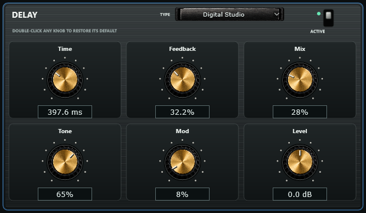
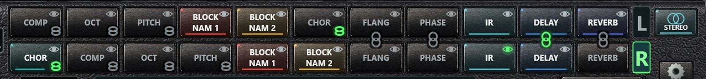

# Bcho NAM Player 1.7.5 - VST3 / AU Plug-in Manual

Complete reference for the plug-in. It shares its engine, its rack, its
effects, its TONE3000 library and its presets with the standalone application,
so this manual documents the plug-in in full and points at the
[standalone manual](USER_MANUAL.en.md) for the chapters that are identical.

---

## Contents

1. [What the plug-in is](#1-what-the-plug-in-is)
2. [Installing](#2-installing)
3. [Your first track](#3-your-first-track)
4. [Map of the editor](#4-map-of-the-editor)
5. [MONO, STEREO and the channel layout](#5-mono-stereo-and-the-channel-layout)
6. [Loading captures and cabinets](#6-loading-captures-and-cabinets)
7. [Controls](#7-controls)
8. [The rack and the eight effects](#8-the-rack-and-the-eight-effects)
9. [Linking effects between L and R](#9-linking-effects-between-l-and-r)
10. [Tuner and Input Cali](#10-tuner-and-input-cali)
11. [TONE3000 inside the plug-in](#11-tone3000-inside-the-plug-in)
12. [Projects, presets and automation](#12-projects-presets-and-automation)
13. [Settings and support](#13-settings-and-support)
14. [Differences from the standalone](#14-differences-from-the-standalone)
15. [Troubleshooting](#15-troubleshooting)
16. [Technical specifications](#16-technical-specifications)
17. [Integrity and licences](#17-integrity-and-licences)

---

## 1. What the plug-in is

An **audio-effect** plug-in - not a MIDI instrument. It carries two complete and
independent signal paths (L and R), each with BLOCK NAM 1, BLOCK NAM 2, a
cabinet IR, an eight-effect rack with free ordering, gate, tone stack, master
level, IR blend, IR volume, input and output gain, power, calibration and tuner.

| Format | Platforms |
| --- | --- |
| VST3 | Windows x64, macOS Intel and Apple Silicon, Linux x86_64 |
| AU | macOS only |

AAX is not included. Match the package to your DAW's process architecture.

---

## 2. Installing

Close the DAW first, and copy the **entire bundle**, not just the binary inside
it.

| System | Destination |
| --- | --- |
| Windows | `C:\Program Files\Common Files\VST3` (administrator permission may be required) |
| macOS VST3 | `~/Library/Audio/Plug-Ins/VST3` |
| macOS AU | `~/Library/Audio/Plug-Ins/Components` |
| Linux | `~/.vst3` |

Start the DAW and rescan plug-ins. The effect appears as **Bcho NAM Player**.

macOS builds are ad-hoc signed, not notarized. If the host blocks the plug-in,
review Privacy & Security and your host's own validation - do not disable system
protection globally.

---

## 3. Your first track

1. Insert the plug-in as an **effect** on a mono or stereo audio track.
2. Select your guitar input in the DAW and enable monitoring. Avoid monitoring
   the same signal twice, through the interface and the DAW.
3. A new instance starts in **MONO** with every block disabled, so your dry
   signal passes through until you load a capture. POWER can mute the path.
4. Load a capture with **BROWSE LOCAL** or **TONE3000**, then a cabinet with
   **BROWSE IR**.
5. Set levels with INPUT GAIN, MASTER VOL and OUTPUT GAIN while watching the
   meters.

> Driver, sample rate and buffer size belong to the DAW. The plug-in has no
> audio-device window.

---

## 4. Map of the editor

The layout is the standalone's, minus the parts a host owns:

- **Rack strip**: preset buttons, the eleven reorderable blocks, the tuner and
  its display, the tuning selector, the MONO / STEREO switch and the settings
  gear.
- **Amplifier head**: Input VU, INPUT GAIN, INPUT CALI; the seven main knobs
  with the NAM and IR selectors above them; the NAM and IR browsers with the IR
  VOL fader; Output VU, OUTPUT GAIN and POWER.
- **Cabinet**: the logo and two cones driven by the real output level.

The editor is fully resizable and keeps its 1537 x 1023 proportions.

---

## 5. MONO, STEREO and the channel layout

The plug-in always presents a **stereo output**, even on a mono track, so both
chains always have somewhere to go.

| Mode | Behaviour |
| --- | --- |
| MONO | Only the left path runs. Its result is copied to both plug-in outputs |
| STEREO | Left path processes input channel 1 and feeds output 1; right path processes input channel 2 and feeds output 2 |

On a **mono track in STEREO**, both chains receive the same input signal, so one
guitar drives two independent rigs. On a **stereo track in STEREO**, the two
input channels are processed separately.

The standalone's DUAL MONO / SPLIT L/R switch is not present: in a DAW you
decide that with the track's own routing.

The `L` / `R` tabs beside the racks choose which path the shared controls edit;
the `NAM 1 L`, `NAM 2 L`, `NAM 1 R`, `NAM 2 R` and `IR L`, `IR R` selectors work
exactly as in the standalone - see
[Which control follows what](USER_MANUAL.en.md#12-mono-and-stereo-two-complete-rigs).

---

## 6. Loading captures and cabinets

Identical to the standalone
([chapter 8](USER_MANUAL.en.md#8-block-nam-1-and-block-nam-2) and
[chapter 9](USER_MANUAL.en.md#9-cabinet-impulse-responses)):

- Choose the target block with the NAM selectors, then **BROWSE LOCAL**, the
  list, **TONE3000**, a double-click on the block, or drag and drop.
- **BROWSE IR** loads a `.wav` response; clicking the selected row again clears
  it and bypasses the IR block.
- Loading a valid file switches its block on. IR gain is never normalized.
- NAM A1, A2 Standard and A2 Nano are detected automatically.
- Hovering a NAM block or list row shows the capture information card.

Demonstration captures ship in the `Models` folder beside the package but are
never loaded automatically; find them with BROWSE LOCAL.

> The DAW project stores **references** to your `.nam` and `.wav` files, not the
> files themselves. Keep them in place, or save `.bnpp` presets, which embed
> them.

---

## 7. Controls

Ranges, defaults and behaviour are the same as the standalone - see
[Amplifier controls, knob by knob](USER_MANUAL.en.md#10-amplifier-controls-knob-by-knob).

In short: INPUT GAIN and OUTPUT GAIN ±12 dB; GATE from OFF to a -80…0 dB
threshold; BASS / MID / TREBLE / PRESENCE ±12 dB at 70 Hz, 750 Hz, 4 kHz and
6 kHz following the selected NAM block; MASTER VOL ±12 dB; IR BLEND 0-100 %;
IR VOL -24…0 dB (default -12 dB) following the selected cabinet; POWER mutes the
path. Drag a knob to change it, double-click to restore its default.

---

## 8. The rack and the eight effects

Identical to the standalone
([chapter 7](USER_MANUAL.en.md#7-the-rack-blocks-order-and-the-eye) and
[chapter 11](USER_MANUAL.en.md#11-the-eight-effects-in-full)): single click
enables or bypasses, double-click opens the editor or the file chooser, drag
reorders around the BLOCK NAM 2 and IR anchors, and the eye chooses which block
the shared controls describe.

Compressor, octaver, pitch shifter, chorus, flanger, phaser, delay and reverb,
each with three algorithms and six real-unit parameters. The full tables are in
the [standalone manual](USER_MANUAL.en.md#11-the-eight-effects-in-full).

---

## 9. Linking effects between L and R

In STEREO the chain icon links an effect of L with the same effect of R, so one
edit changes both. Green = linked, grey = not. When the two blocks share a
column the icon sits on the seam between the rows; when they do not, it moves to
the lower-right corner of both blocks.

Linked blocks share the algorithm and the six parameters; each keeps its own
on/off switch and its own position. Linking two blocks that differ asks which
side's settings to keep. BLOCK NAM 1, BLOCK NAM 2 and IR cannot be linked.
**Links are saved in the DAW project.** Full description:
[standalone chapter 13](USER_MANUAL.en.md#13-linking-effects-between-l-and-r).

---

## 10. Tuner and Input Cali

**TUNER** works exactly as in the standalone: it listens to the untouched DI
before the gate and the NAM blocks, covers roughly 65-700 Hz, reads centred
within ±5 cents, and offers STANDARD, DROP D, D STANDARD, Eb and OPEN G. Play
one isolated string at a useful level.

**INPUT CALI** uses the engine's reference and the capture's `input_level_dbu`
metadata (assuming +12 dBu when a capture has none), clamped to ±24 dB. The
plug-in does **not** expose the standalone's interface-reference slider, because
the interface belongs to the DAW: for a specific hardware calibration, set the
gain outside the plug-in or use the standalone.

---

## 11. TONE3000 inside the plug-in

The **TONE3000** button opens the same library window as the standalone.

- Connect the account once; the encrypted refresh token is stored per user, so
  the plug-in never needs a browser again on that computer.
- TRENDING, LATEST, FAVOURITES, DOWNLOADED and MINE.
- **Selecting a row loads that capture into the current NAM block immediately**;
  the rest of the tone downloads in the background, and picking another row
  cancels it. A tone already in your downloads loads instantly.
- Rows marked **IR only - no NAM** hold only impulse responses and are not
  auditioned.
- **RESTORE PREVIOUS MODEL** puts back what the block held before the window was
  opened; closing the window keeps the last audition.
- **SEARCH FULL CATALOGUE** opens TONE3000's own picker inside the plug-in; when
  you choose a tone the picker closes by itself and the download starts.

On Windows the embedded browser uses WebView2. Inside a DAW the plug-in stores
its WebView2 data in a per-user folder, so a host installed in Program Files
never blocks it. If WebView2 is missing, the plug-in offers an official
Microsoft download or your external browser and installs nothing automatically.
Full detail: [standalone chapter 16](USER_MANUAL.en.md#16-tone3000-inside-the-player).

---

## 12. Projects, presets and automation

**The DAW project** stores everything about the instance: both paths, every
control, the file references, rack order, algorithms, parameters, bypass states,
the L/R links, and MONO/STEREO.

Reopening a project re-loads the saved NAM, pedal NAM and IR of **both** paths
into the engine with their saved on/off states - whatever order the host uses to
restore the state and prepare audio, and with the editor closed. Project
restore, capture changes and audio re-initialisation (a sample-rate or
buffer-size change) all fade in from silence, so nothing clicks.

**`.bnpp` presets.** SAVE PRESET writes a portable archive for the **selected
path** with its BLOCK NAM 1, BLOCK NAM 2, IR and settings embedded and checked
with SHA-256; LOAD PRESET replaces that path. Share both paths as two presets;
use the project to recall the whole instance. A two-path standalone preset loads
its left-path representation into the selected plug-in path.

**Automation.** The host can automate the published parameters, per path:

| Parameter | Per path |
| --- | --- |
| Input Gain, Gate, Bass, Mid, Treble, Presence, Master Vol | `L_` and `R_` |
| NAM 1 Bass, NAM 1 Mid, NAM 1 Treble, NAM 1 Presence | `L_` and `R_` |
| IR Blend, IR Cabinet Volume, Output Gain | `L_` and `R_` |
| Power, Input Cali, Tuner | `L_` and `R_` |
| Stereo (MONO / STEREO) | one, global |

Rack order, effect algorithms and effect parameters are part of the saved state,
not host automation. Loading a file is a load, not a continuous parameter.

---

## 13. Settings and support

The gear opens a short window with the version and a link to support the
project.

---

## 14. Differences from the standalone

| The standalone has | The plug-in |
| --- | --- |
| Audio Setup: driver, interface, channels, sample rate, buffer | The DAW owns all of it |
| Physical MAIN / PRE / DI / WET output routing | Route inside the DAW |
| DUAL MONO / SPLIT L/R input switch | Decided by the track's routing |
| Interface input reference slider for Input Cali | Not exposed; calibrate outside or use the standalone |
| Eleven selectable skins | Always Astra / Obsidian |
| Its own saved session between launches | State comes from the host project |
| Update checking | Not included |

Everything else - engine, rack, effects, links, tuner, browsers, TONE3000,
information card, `.bnpp` presets - is the same code.

---

## 15. Troubleshooting

| Symptom | What to check |
| --- | --- |
| Not listed after scanning | Folder, format and architecture match the host; then rescan |
| No audio | Track input, monitoring, POWER, and the DAW's own routing |
| Dry sound only | A capture is loaded and its block is lit; a fully bypassed chain passes dry audio |
| One side silent in STEREO | The DAW must actually feed both channels; on a mono track both chains get the same input |
| Missing files after moving a project | Restore the `.nam` / `.wav` locations, or load your `.bnpp` presets |
| Dropouts | Raise the buffer and lower CPU load; four NAM blocks across two paths is demanding |
| Empty TONE3000 window | Account, network, or WebView2 on Windows; or use the external browser |
| macOS host rejects it | Review host validation and system permissions; ad-hoc signing is not notarization |
| The DAW process stayed alive after closing a project | A plug-in unload deadlock fixed in 1.7.5. End the leftover process once from the task manager and update the plug-in |

---

## 16. Technical specifications

| Item | Value |
| --- | --- |
| Plug-in type | Audio effect (no MIDI) |
| Bus layout | Mono or stereo input, **always stereo output** |
| Signal paths | 2 independent (L / R) |
| NAM blocks | 2 per path; IR 1 per path; 8 effects per path |
| Sample rates / buffers | Whatever the host provides; oversized host buffers are split internally |
| NAM architectures | A1, A2 Standard, A2 Nano - automatic |
| Start-up / re-prepare fade | 60 ms from silence |
| NAM change fade | 15 ms out, silence until the new capture is installed, 20 ms in |
| IR change fade | 12 ms crossfade |
| Editor | 1537 x 1023 native, resizable, proportional |

---

## 17. Integrity and licences

Check ZIP hashes against `SHA256SUMS.txt` and read `THIRD_PARTY_NOTICES.md`
(JUCE and Neural Amp Modeler Core). Respect the licences of the captures and
impulse responses you use or share inside presets. These manuals do not imply
certification in every DAW; each host and system combination deserves a
practical check.
