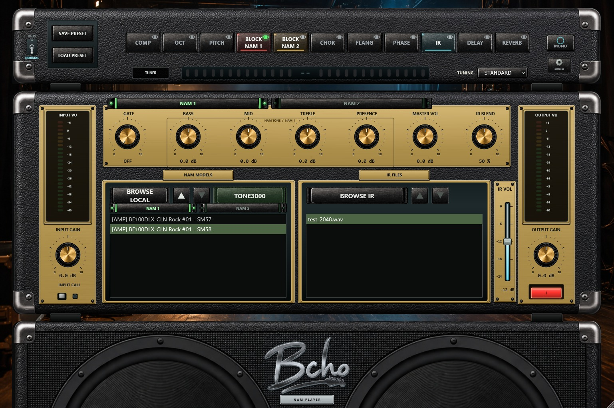
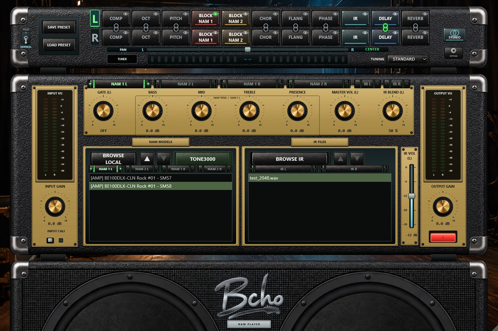
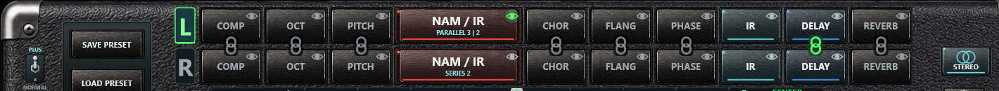
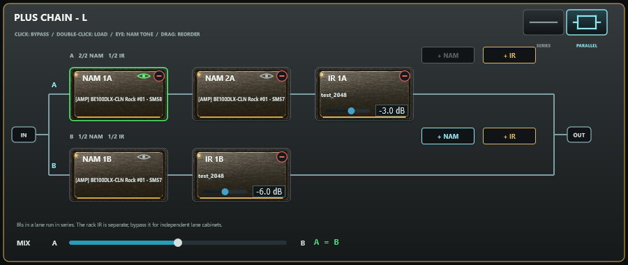
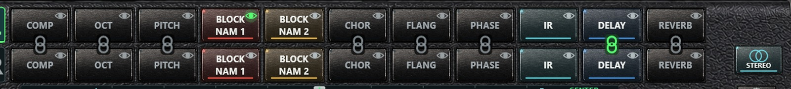
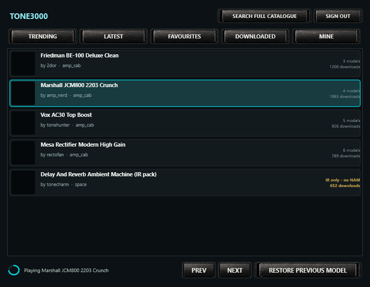
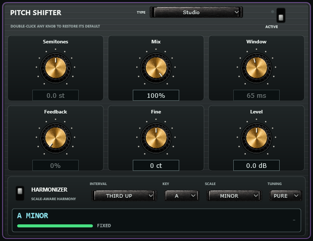

# Bcho NAM Player 1.8.0 - VST3 / AU Plug-in Manual

Complete reference for the 1.8.0 plugin: installation, routing, NORMAL / PLUS, NAM/IR files, controls, all effect parameters, HARMONIZER, presets and automation. The standalone-only DI player is not part of the plugin.

---

## Contents

1. [What the plug-in is](#1-what-the-plug-in-is)
2. [Installing](#2-installing)
3. [Your first track](#3-your-first-track)
4. [Map of the editor](#4-map-of-the-editor)
5. [MONO, STEREO and the channel layout](#5-mono-stereo-and-the-channel-layout)
6. [Loading captures and cabinets](#6-loading-captures-and-cabinets)
7. [Controls](#7-controls)
8. [The rack and the eight effects](#8-the-rack-and-the-eight-effects)
9. [Linking effects between L and R](#9-linking-effects-between-l-and-r)
10. [Tuner and Input Cali](#10-tuner-and-input-cali)
11. [TONE3000 inside the plug-in](#11-tone3000-inside-the-plug-in)
12. [Projects, presets and automation](#12-projects-presets-and-automation)
13. [Settings and support](#13-settings-and-support)
14. [Differences from the standalone](#14-differences-from-the-standalone)
15. [Troubleshooting](#15-troubleshooting)
16. [Technical specifications](#16-technical-specifications)
17. [Integrity and licences](#17-integrity-and-licences)
18. [Appendix A: complete effects reference](#appendix-a-complete-effects-reference)

---

## 1. What the plug-in is

An **audio-effect** plug-in - not a MIDI instrument. It carries two complete and
independent signal paths (L and R), each with (in NORMAL) BLOCK NAM 1, BLOCK NAM 2, a
cabinet IR, an eight-effect rack with free ordering, gate, tone stack, master
level, IR blend, IR volume, input and output gain, power, calibration and tuner.

| Format | Platforms |
| --- | --- |
| VST3 | Windows x64, macOS Intel and Apple Silicon, Linux x86_64 |
| AU | macOS only |

AAX is not included. Match the package to your DAW's process architecture.

---

## 2. Installing

Close the DAW first, and copy the **entire bundle**, not just the binary inside
it.

| System | Destination |
| --- | --- |
| Windows | `C:\Program Files\Common Files\VST3` (administrator permission may be required) |
| macOS VST3 | `~/Library/Audio/Plug-Ins/VST3` |
| macOS AU | `~/Library/Audio/Plug-Ins/Components` |
| Linux | `~/.vst3` |

Start the DAW and rescan plug-ins. The effect appears as **Bcho NAM Player**.

macOS builds are ad-hoc signed, not notarized. If the host blocks the plug-in,
review Privacy & Security and your host's own validation - do not disable system
protection globally.

---

## 3. Your first track

1. Insert the plug-in as an **effect** on a mono or stereo audio track.
2. Select your guitar input in the DAW and enable monitoring. Avoid monitoring
   the same signal twice, through the interface and the DAW.
3. A new instance starts in **MONO** with every block disabled, so your dry
   signal passes through until you load a capture. POWER can mute the path.
4. Load a capture with **BROWSE LOCAL** or **TONE3000**, then a cabinet with
   **BROWSE IR**.
5. Set levels with INPUT GAIN, MASTER VOL and OUTPUT GAIN while watching the
   meters.

> Driver, sample rate and buffer size belong to the DAW. The plug-in has no
> audio-device window.

---

## 4. Map of the editor

The layout is the standalone's, minus the parts a host owns:

- **Rack strip**: preset buttons, NORMAL / PLUS, the processing blocks, the tuner and
  its display, the tuning selector, the MONO / STEREO switch and the settings
  gear.
- **Amplifier head**: Input VU, INPUT GAIN, INPUT CALI; the seven main knobs
  with the NAM and IR selectors above them; the NAM and IR browsers with the IR
  VOL fader; Output VU, OUTPUT GAIN and POWER.
- **Cabinet**: the logo and two cones driven by the real output level.

The editor is fully resizable and keeps its 1537 x 1023 proportions.

---

## 5. MONO, STEREO and the channel layout

The plug-in always presents a **stereo output**, even on a mono track, so both
chains always have somewhere to go.

| Mode | Behaviour |
| --- | --- |
| MONO | Only the left path runs. Its result is copied to both plug-in outputs |
| STEREO | Left path processes input channel 1 and feeds output 1; right path processes input channel 2 and feeds output 2 |

On a **mono track in STEREO**, both chains receive the same input signal, so one
guitar drives two independent rigs. On a **stereo track in STEREO**, the two
input channels are processed separately.

The standalone's DUAL MONO / SPLIT L/R switch is not present: in a DAW you
decide that with the track's own routing.

**PAN** (the bar between the two rack rows and the tuner, STEREO only): a
horizontal fader that balances the level of the two paths.

| Position | Result |
| --- | --- |
| Centre (`CENTER`, centre notch, green mark) | L and R play at their full level, exactly as without PAN |
| Towards `L` | The right path fades out progressively; at the left stop (`L 100 %`) only L is heard |
| Towards `R` | The left path fades out progressively; at the right stop (`R 100 %`) only R is heard |

The `L` and `R` letters at the ends are lamps: the one on the side being faded
dims, and the rail lights up from the centre towards the favoured side. Neither
side ever gets louder than it is at the centre. Double-click returns the fader
to the centre; the mouse wheel moves it in fine steps.

In the plug-in PAN is an automatable parameter (`Pan`) and is saved with the project.

The `L` / `R` tabs beside the racks choose which path the shared controls edit;
the `NAM 1 L`, `NAM 2 L`, `NAM 1 R`, `NAM 2 R` and `IR L`, `IR R` selectors work
exactly as in the standalone - see
[Which control follows what](USER_MANUAL.en.md#12-mono-and-stereo-two-complete-rigs).

---

## 6. Loading captures and cabinets

Identical to the standalone
([chapter 8](USER_MANUAL.en.md#8-block-nam-1-and-block-nam-2) and
[chapter 9](USER_MANUAL.en.md#9-cabinet-impulse-responses)):

- Choose the target block with the NAM selectors, then **BROWSE LOCAL**, the
  list, **TONE3000**, a double-click on the block, or drag and drop.
- **BROWSE IR** loads a `.wav` response; clicking the selected row again clears
  it and bypasses the IR block.
- Loading a valid file switches its block on. IR gain is never normalized.
- NAM A1, A2 Standard and A2 Nano are detected automatically.
- Hovering a NAM block or list row shows the capture information card.

Demonstration captures ship in the `Models` folder beside the package but are
never loaded automatically; find them with BROWSE LOCAL.

> The DAW project stores **references** to your `.nam` and `.wav` files, not the
> files themselves, including PLUS AIFF/FLAC IR files. Keep them in place, or save `.bnpp` presets, which embed
> them.

---

## 7. Controls

**Operating a knob**: drag vertically or horizontally; the exact value is
printed underneath. **Double-click restores the default** - 12 o'clock for
everything except GATE, which returns to fully left (OFF).

| Control | Range | Default | Notes |
| --- | --- | --- | --- |
| INPUT GAIN | -12 … +12 dB | 0.0 dB | Level into the NAM chain; Input Cali is added on top |
| GATE | OFF … -80 … 0 dB threshold | OFF | At the far left it is a true bypass. Attack 1.5 ms, hold 35 ms, release 90 ms, 3 dB hysteresis |
| BASS | ±12 dB @ 70 Hz | 0.0 dB | Peaking, Q 0.72 |
| MID | ±12 dB @ 750 Hz | 0.0 dB | Peaking, Q 0.72 |
| TREBLE | ±12 dB @ 4 kHz | 0.0 dB | Peaking, Q 0.72 |
| PRESENCE | ±12 dB @ 6 kHz | 0.0 dB | Peaking, Q 0.72 |
| MASTER VOL | -12 … +12 dB | 0.0 dB | After the chain, before Output Gain |
| IR BLEND | 0 … 100 % | 50 % | Dry against cabinet |
| IR VOL | -24 … 0 dB | -12 dB | Cabinet branch only |
| OUTPUT GAIN | -12 … +12 dB | 0.0 dB | Final level |
| POWER | On / off | On | Mutes the processed path; the switch glows red while on |
| INPUT CALI | On / off | Off | See Input Cali in chapter 10 |

**The tone stack follows the selected NAM block.** With a **NAM 1** selector
active, BASS / MID / TREBLE / PRESENCE drive BLOCK NAM 1's own four filters;
with a **NAM 2** selector active they drive the main tone stack. Each set keeps
its own values, and switching selectors recalls them. In the plug-in and in
STEREO the plate prints which one you are editing.

---

## 8. The rack and the eight effects

Identical to the standalone
([chapter 7](USER_MANUAL.en.md#7-the-rack-blocks-order-and-the-eye) and
[chapter 11](USER_MANUAL.en.md#11-the-eight-effects-in-full)): single click
enables or bypasses, double-click opens the editor or the file chooser, drag
reorders around the BLOCK NAM 2 and IR anchors, and the eye chooses which block
the shared controls describe.

Compressor, octaver, pitch shifter, chorus, flanger, phaser, delay and reverb,
each with three algorithms and six real-unit parameters. The complete parameter tables and HARMONIZER instructions are in Appendix A below.

### NORMAL / PLUS: NAM and IR chains

The lever switch on the left end of the rack chooses between two ways of using
NAM captures:

| Position | What the rack shows |
| --- | --- |
| NORMAL (lever down) | BLOCK NAM 1 and BLOCK NAM 2, exactly as described above |
| PLUS (lever up) | One large **NAM / IR** block, twice as wide, at BLOCK NAM 1's position in the chain |

The NAM / IR block of PLUS runs a **chain** of NAM and cabinet IR blocks. It switches on and off with
a click and has the eye like any other NAM block; the line under its name shows
the chain, for example `SERIES 2` or `PARALLEL 2 | 1`. **Double-click it** to open
the PLUS CHAIN window:

| Element | Use |
| --- | --- |
| Single-line / parallel-lines switch | **SERIES**: one lane from IN to OUT. **PARALLEL**: two lanes, A above and B below, fed by the same input and mixed back together |
| NAM 1A / 2A and IR 1A / 2A (likewise B) | Up to two NAMs and two IRs per lane. Each lane retains one NAM placeholder. Blocks run in the displayed order |
| Click on a block | On / off (an empty block opens the load menu instead) |
| Double-click or right-click | NAM: load a local capture or use TONE3000. IR: load a local WAV, AIFF or FLAC. Remove block is available when allowed |
| Drop a file | Drop `.nam` on a NAM card or + NAM; drop WAV, AIFF or FLAC on an IR card or + IR |
| Eye (NAM cards only) | Select the NAM block edited by BASS, MID, TREBLE, PRESENCE and loaded from the NAM MODELS list or TONE3000 |
| `-` (top right corner) | Remove the block, after confirmation. The last NAM of a lane cannot be removed; all IRs can be removed |
| **+ NAM / + IR** | Add the chosen type; each button becomes unavailable at its two-block limit. New NAMs are inserted before IRs |
| IR level | -24 to +12 dB, initially 0 dB; double-click to reset. WAV, AIFF and FLAC, mono or stereo averaged to mono, up to 8192 source samples, resampled without normalization |
| Drag a block | Reorder it, also into the other lane (if its two-NAM / two-IR limits allow it) |
| MIX A - B (PARALLEL only) | Linear crossfade: centre gives 50% of each lane; the ends give 100% of A or B. Unlike PAN, centre is not full level on both lanes |

Each NAM block keeps its own capture, on/off switch and tone controls, just like
BLOCK NAM 1 and BLOCK NAM 2. In PLUS the NAM selectors above the tone plate and
over the list become one per path, captioned with the block being edited
(`NAM 2A`), and the list shows the NAM models of that block.

The first time PLUS is switched on, loaded NORMAL NAM captures are copied into lane A in rack order, with their bypass and tone settings. An empty NAM placeholder remains if neither capture is loaded. The general rack IR is not copied into a lane. NORMAL and PLUS keep separate settings: going back to
NORMAL finds BLOCK NAM 1 and BLOCK NAM 2 exactly as they were. The switch, the
chains and their captures are saved with the session, in presets (the `.bnpp`
bundle embeds every chain capture and IR) and, in the plug-in, with the DAW project.
Every change of the chain is applied behind a short fade, with a short transition to suppress clicks.
With INPUT CALI on, PLUS calibrates to the first active NAM of lane A; standalone DI playback bypasses interface calibration.

IRs within a lane run in series. To mix two cabinets, put one in each parallel lane and use A/B MIX. The rack IR remains a separate shared block: bypass it when using independent lane cabinets to avoid filtering the signal twice. IR files load in the background, and their level, order and bypass state are saved with the chain. Legacy chains with more than two NAMs per lane restore the first two and show a notice; keep the original preset if you need its older configuration.

The PITCH block includes a scale-aware **HARMONIZER** (thirds and fifths that follow the key, octaves, AUTO key detection): see HARMONIZER in Appendix A.

---

## 9. Linking effects between L and R

In STEREO the chain icon links an effect of L with the same effect of R, so one
edit changes both. Green = linked, grey = not. When the two blocks share a
column the icon sits on the seam between the rows; when they do not, it moves to
the lower-right corner of both blocks.

Linked blocks share the algorithm and the six parameters; each keeps its own
on/off switch and its own position. Linking two blocks that differ asks which
side's settings to keep. BLOCK NAM 1, BLOCK NAM 2 and IR cannot be linked.
**Links are saved in the DAW project.** Full description:
[standalone chapter 13](USER_MANUAL.en.md#13-linking-effects-between-l-and-r).

---

## 10. Tuner and Input Cali

**TUNER** works exactly as in the standalone: it listens to the untouched DI
before the gate and the NAM blocks, covers roughly 65-700 Hz, reads centred
within ±5 cents, and offers STANDARD, DROP D, D STANDARD, Eb and OPEN G. Play
one isolated string at a useful level.

**INPUT CALI** uses the engine's reference and the capture's `input_level_dbu`
metadata (assuming +12 dBu when a capture has none), clamped to ±24 dB. The
plug-in does **not** expose the standalone's interface-reference slider, because
the interface belongs to the DAW: for a specific hardware calibration, set the
gain outside the plug-in or use the standalone.

---

## 11. TONE3000 inside the plug-in

The **TONE3000** button opens the same library window as the standalone.

- Connect the account once; the encrypted refresh token is stored per user, so
  subsequent connections can reuse it while authorization remains valid. Reconnect if it expires or is revoked.
- TRENDING, LATEST, FAVOURITES, DOWNLOADED and MINE.
- **Selecting a row loads that capture into the current NAM block immediately**;
  the rest of the tone downloads in the background, and picking another row
  cancels it. A tone already in your downloads loads instantly.
- Rows marked **IR only - no NAM** hold only impulse responses and are not
  auditioned.
- **RESTORE PREVIOUS MODEL** puts back what the block held before the window was
  opened; closing the window keeps the last audition.
- **SEARCH FULL CATALOGUE** opens TONE3000's own picker inside the plug-in; when
  you choose a tone the picker closes by itself and the download starts.

On Windows the embedded browser uses WebView2. Inside a DAW the plug-in stores
its WebView2 data in a per-user folder, so a host installed in Program Files
never blocks it. If WebView2 is missing, the plug-in offers an official
Microsoft download or your external browser and installs nothing automatically.
Full detail: [standalone chapter 16](USER_MANUAL.en.md#16-tone3000-inside-the-player).

---

## 12. Projects, presets and automation

**The DAW project** stores everything about the instance: both paths, every
control, the file references, rack order, algorithms, parameters, bypass states,
the L/R links, and MONO/STEREO.

Reopening a project re-loads the saved NAM, pedal NAM and IR of **both** paths
into the engine with their saved on/off states - whatever order the host uses to
restore the state and prepare audio, and with the editor closed. Project
restore, capture changes and audio re-initialisation (a sample-rate or
buffer-size change) all fade in from silence, so nothing clicks.

**`.bnpp` presets.** SAVE PRESET writes a portable archive for the **selected
path** with its NORMAL and PLUS NAM/IR files and settings embedded and checked
with SHA-256; LOAD PRESET replaces that path. Share both paths as two presets;
use the project to recall the whole instance. A two-path standalone preset loads
its left-path representation into the selected plug-in path.

**Automation.** The host can automate the published parameters, per path:

| Parameter | Per path |
| --- | --- |
| Input Gain, Gate, Bass, Mid, Treble, Presence, Master Vol | `L_` and `R_` |
| NAM 1 Bass, NAM 1 Mid, NAM 1 Treble, NAM 1 Presence | `L_` and `R_` |
| IR Blend, IR Cabinet Volume, Output Gain | `L_` and `R_` |
| Power, Input Cali, Tuner | `L_` and `R_` |
| Stereo (MONO / STEREO) | one, global |
| Pan (only acts in STEREO) | one, global |

Rack order, effect algorithms and effect parameters are part of the saved state,
not host automation. PLUS mode, topology, per-block files, tone, levels and bypass are saved in state, without adding host automation parameters. DI playback adds no controls, parameters or state to the plugin. Loading a file is a load, not a continuous parameter.

---

## 13. Settings and support

The gear opens a short window with the version and a link to support the
project.

---

## 14. Differences from the standalone

| The standalone has | The plug-in |
| --- | --- |
| Audio Setup: driver, interface, channels, sample rate, buffer | The DAW owns all of it |
| Physical MAIN / PRE / DI / WET output routing | Route inside the DAW |
| DUAL MONO / SPLIT L/R input switch | Decided by the track's routing |
| Interface input reference slider for Input Cali | Not exposed; calibrate outside or use the standalone |
| Eleven selectable skins | Always Astra / Obsidian |
| Its own saved session between launches | State comes from the host project |
| Update checking | Not included |
| IN / DI player, CONFIG DI, transport and DI file state | Not included. Play and route DI audio tracks in the DAW |

Everything else - engine, rack, effects, links, tuner, browsers, TONE3000,
information card, `.bnpp` presets - is the same code.

---

## 15. Troubleshooting

| Symptom | What to check |
| --- | --- |
| Not listed after scanning | Folder, format and architecture match the host; then rescan |
| No audio | Track input, monitoring, POWER, and the DAW's own routing |
| Dry sound only | A capture is loaded and its block is lit; a fully bypassed chain passes dry audio |
| One side silent in STEREO | The DAW must actually feed both channels; on a mono track both chains get the same input |
| Missing files after moving a project | Restore the `.nam` / `.wav` locations, or load your `.bnpp` presets |
| Dropouts | Raise the buffer and lower CPU load; PLUS can run eight NAM blocks across two paths, in addition to IRs and effects |
| Empty TONE3000 window | Account, network, or WebView2 on Windows; or use the external browser |
| macOS host rejects it | Review host validation and system permissions; ad-hoc signing is not notarization |

---

## 16. Technical specifications

| Item | Value |
| --- | --- |
| Plug-in type | Audio effect (no MIDI) |
| Bus layout | Mono or stereo input, **always stereo output** |
| Signal paths | 2 independent (L / R) |
| NORMAL | 2 NAM and 1 rack IR per path; 8 effects per path |
| PLUS | 2 NAM + 2 IR per lane, up to 2 lanes per path; general rack IR remains separate |
| Internal version | 1.8.0 (numeric version 0x10800); VST3 and AU metadata derive from the same project version |
| Sample rates / buffers | Whatever the host provides; oversized host buffers are split internally |
| NAM architectures | A1, A2 Standard, A2 Nano - automatic |
| Start-up / re-prepare fade | 60 ms from silence |
| NAM change fade | 15 ms out, silence until the new capture is installed, 20 ms in |
| IR change fade | 12 ms crossfade |
| Editor | 1537 x 1023 native, resizable, proportional |

---

## 17. Integrity and licences

Check ZIP hashes against `SHA256SUMS.txt` and read `THIRD_PARTY_NOTICES.md`
(JUCE and Neural Amp Modeler Core). Respect the licences of the captures and
impulse responses you use or share inside presets. These manuals do not imply
certification in every DAW; each host and system combination deserves a
practical check.

---

## Appendix A. Complete effects reference

The eight effects offer **three algorithms** and **six main parameters** each. PITCH also includes the HARMONIZER controls described below. Double-click a
block to open its editor; every knob shows a real unit, and double-clicking a
knob restores its default.

The **ACTIVE** switch at the top right of the editor is the same bypass as
clicking the block. **TYPE** chooses the algorithm. Parameter, algorithm and
bypass changes are smoothed, delay-family reads are interpolated and feedback is
bounded, so nothing clicks or runs away.

### COMP - compressor
Algorithms: **Studio VCA**, **Optical**, **FET Punch**.

| Parameter | Range | Default |
| --- | --- | --- |
| Threshold | -55 … -2 dB | -31.2 dB |
| Ratio | 1 … 20 :1 | 7.7:1 |
| Attack | 1 … 100 ms | 15.9 ms |
| Release | 20 … 600 ms | 223 ms |
| Makeup | -12 … +12 dB | 0.0 dB |
| Mix | 0 … 100 % | 100 % |

### DELAY
Algorithms: **Digital Studio**, **Tape Echo**, **Analog BBD**.

| Parameter | Range | Default |
| --- | --- | --- |
| Time | 20 … 1200 ms | 398 ms |
| Feedback | 0 … 92 % | 32 % |
| Mix | 0 … 100 % | 28 % |
| Tone | 0 … 100 % | 65 % |
| Mod | 0 … 100 % | 8 % |
| Level | -12 … +12 dB | 0.0 dB |

### CHOR - chorus
Algorithms: **Studio**, **Ensemble**, **Tri-Chorus**.

| Parameter | Range | Default |
| --- | --- | --- |
| Rate | 0.05 … 5 Hz | 1.24 Hz |
| Depth | 0.5 … 20 ms | 10.3 ms |
| Mix | 0 … 100 % | 35 % |
| Delay | 4 … 30 ms | 11.8 ms |
| Feedback | -65 … +65 % | 0 % |
| Level | -12 … +12 dB | 0.0 dB |

### FLANG - flanger
Algorithms: **Analog**, **Through-Zero**, **Jet**.

| Parameter | Range | Default |
| --- | --- | --- |
| Rate | 0.03 … 2.5 Hz | 0.57 Hz |
| Depth | 0.1 … 9 ms | 5.0 ms |
| Mix | 0 … 100 % | 35 % |
| Feedback | -85 … +85 % | 20 % |
| Manual | 0.2 … 5 ms | 1.4 ms |
| Level | -12 … +12 dB | 0.0 dB |

### PHASE - phaser
Algorithms: **4 Stage**, **8 Stage**, **12 Stage**.

| Parameter | Range | Default |
| --- | --- | --- |
| Rate | 0.03 … 4 Hz | 0.82 Hz |
| Depth | 0 … 100 % | 70 % |
| Mix | 0 … 100 % | 40 % |
| Feedback | -75 … +75 % | 12 % |
| Centre | 180 … 2200 Hz | 887 Hz |
| Level | -12 … +12 dB | 0.0 dB |

### REVERB
Algorithms: **Studio Room**, **Plate**, **Concert Hall**.

| Parameter | Range | Default |
| --- | --- | --- |
| Size | 0 … 100 % | 55 % |
| Damping | 0 … 100 % | 50 % |
| Mix | 0 … 100 % | 25 % |
| Width | 0 … 100 % | 80 % |
| Freeze | OFF / ON | OFF |
| Level | -12 … +12 dB | 0.0 dB |

### OCT - octaver
Algorithms: **Poly Clean**, **Classic Mono**, **Organ**.

| Parameter | Range | Default |
| --- | --- | --- |
| Oct Down | 0 … 100 % | 45 % |
| Oct Up | 0 … 100 % | 0 % |
| Dry | 0 … 100 % | 80 % |
| Tone | 0 … 100 % | 50 % |
| Tracking | 0 … 100 % | 65 % |
| Level | -12 … +12 dB | 0.0 dB |

### PITCH - pitch shifter
Algorithms: **Studio**, **Low Latency**, **Vintage**.

| Parameter | Range | Default |
| --- | --- | --- |
| Semitones | -12 … +12 st | 0.0 st |
| Mix | 0 … 100 % | 100 % |
| Window | 20 … 120 ms | 65 ms |
| Feedback | 0 … 55 % | 0 % |
| Fine | -100 … +100 ct | 0 ct |
| Level | -12 … +12 dB | 0.0 dB |

#### HARMONIZER (scale-aware harmony)

The strip at the bottom of the PITCH window turns the block into an intelligent
harmonizer. With **HARMONIZER** on, every note you play gets a second voice a
scale step away, using the selected or detected scale:

| INTERVAL | Harmony voice |
| --- | --- |
| OCTAVE UP / OCTAVE DOWN | Always an octave; needs no key, sounds from the first note and also works on chords |
| THIRD UP / THIRD DOWN | The third of the scale: **major or minor depending on the note**. In C major, C gets E (major third) and D gets F (minor third); in C minor, C gets Eb |
| FIFTH UP / FIFTH DOWN | The fifth of the scale: perfect, or diminished on the seventh degree (B -> F in C major) |

**KEY and SCALE.** With KEY on **AUTO** the key is learned from the notes you play:

- It works on the seven notes in use, which is what decides the harmony. A key is
  told apart from its parallel (C major / C minor) by the notes actually played (E
  or Eb, A or Ab, B or Bb); a key, its relative and its modes (C major, A minor, D
  dorian...) share their notes and therefore their harmony.
- The tonic and the mode are named from where the playing dwells and, above all,
  where phrases come to rest: the display can read `A MINOR`, `D DORIAN`,
  `G MIXOLYDIAN`... Pentatonic playing is read as the natural minor / major until
  other notes say otherwise. **Harmonic minor** is recognised when the raised
  seventh is used throughout (G# and never G in A minor): the dominant then gets
  its major third.
- Two memories run side by side: a long one keeps the key steady and a short one
  follows a real key change within a few seconds. The detector resists short passing notes; fix KEY manually if automatic detection does not match your phrase.
- Until enough notes have been heard the display shows **LISTENING...** and thirds
  and fifths stay silent, until detection has enough confidence. The bar under the key
  shows how sure the detection is.

Choose a tonic in **KEY** to fix the key yourself; **SCALE** then offers major,
minor, the five other modes, harmonic minor and melodic minor.

**TUNING.** **PURE** tunes each interval to the played note with simple ratios (5:4
and 6:5 thirds, 3:2 fifths): the two voices lock together without beating, which
is what keeps a harmony clean through an overdriven amp. **TEMPERED** uses the
piano's equal semitones, to match keyboards exactly.

**The voice.** The harmony is made by a shifter of its own whose splices are
synchronised to the period of the note being played, so it sounds like a second
guitar rather than an effect. It reads the guitar a few milliseconds late - the
natural delay of a second player - and uses that time to know each new note
before it sounds: a note never comes out with the interval of the previous one.
Notes are recognised from low E (and drop tunings) up to the 24th fret, within a
few cents, in about 25 ms (45 ms on the lowest strings). Bends and vibrato are
followed continuously: in a bend from C to D in C major the harmony slides from E
to F. Notes outside the key (a blue note, the G# of A minor) borrow the scale
degree that gives a real third or fifth: G# gets B, Bb in C major gets D.

**Knobs in HARMONIZER mode**: **MIX** balances the harmony against the note you
play, which always stays (100 % = both at the same level, 0 % = no harmony);
**FINE** detunes the harmony slightly for a wider sound; **LEVEL** works as usual.
SEMITONES, WINDOW and FEEDBACK rest. TYPE chooses the character of the voice:
**Studio**, **Low Latency** (a shorter delay; very fast phrases may lose a little
accuracy on low notes) and **Vintage** (darker). The rack block reads **HARMONY**
while the harmonizer is on.

Play single notes: thirds and fifths follow melodies, riffs and solos. For thirds and fifths, use single-note playing. Polyphonic or unclear input can make pitch detection unreliable; the detector may suppress the harmony. Detection uses the clean
guitar signal, before gain, NAM and effects. The HARMONIZER settings are saved
with the PITCH block and follow an L / R link.
