# Bcho NAM Player 1.8.0 - Manual de usuario (standalone)

Referencia completa de la aplicación standalone para Windows, macOS y Linux.
Esta guía describe los controles, archivos, recorridos de señal y recuperación de sesión de la versión 1.8.0. Para el plugin
VST3 / AU, consulta el [manual del plugin](PLUGIN_MANUAL.es.md).

---

## Contenido

1. [Qué es Bcho NAM Player](#1-qué-es-bcho-nam-player)
2. [Instalación y primer arranque](#2-instalación-y-primer-arranque)
3. [Mapa de la ventana](#3-mapa-de-la-ventana)
4. [Inicio rápido: sonido en cinco pasos](#4-inicio-rápido-sonido-en-cinco-pasos)
5. [Audio Setup: dispositivo, latencia y ruteo](#5-audio-setup-dispositivo-latencia-y-ruteo)
6. [Recorrido de la señal](#6-recorrido-de-la-señal)
   - [Reproductor IN / DI y transporte](#in--di-elegir-la-fuente-solo-standalone)
7. [El rack: bloques, orden y el ojo](#7-el-rack-bloques-orden-y-el-ojo)
8. [BLOCK NAM 1 y BLOCK NAM 2](#8-block-nam-1-y-block-nam-2)
9. [Respuestas impulsionales de pantalla](#9-respuestas-impulsionales-de-pantalla)
10. [Los mandos, uno a uno](#10-los-mandos-uno-a-uno)
11. [Los ocho efectos al detalle](#11-los-ocho-efectos-al-detalle)
12. [MONO y STEREO: dos equipos completos](#12-mono-y-stereo-dos-equipos-completos)
13. [Enlazar efectos entre L y R](#13-enlazar-efectos-entre-l-y-r)
14. [Afinador](#14-afinador)
15. [Input Cali (calibración automática de entrada)](#15-input-cali-calibración-automática-de-entrada)
16. [TONE3000 dentro del reproductor](#16-tone3000-dentro-del-reproductor)
17. [Presets portables .bnpp](#17-presets-portables-bnpp)
18. [Qué se recuerda y dónde](#18-qué-se-recuerda-y-dónde)
19. [Ajustes, acabados, actualizaciones y apoyo](#19-ajustes-acabados-actualizaciones-y-apoyo)
20. [Vúmetros y conos animados](#20-vúmetros-y-conos-animados)
21. [Referencia de ratón y teclado](#21-referencia-de-ratón-y-teclado)
22. [Resolución de problemas](#22-resolución-de-problemas)
23. [Especificaciones técnicas](#23-especificaciones-técnicas)
24. [Integridad, código de terceros y licencias](#24-integridad-código-de-terceros-y-licencias)

---

## 1. Qué es Bcho NAM Player

Bcho NAM Player es un procesador de guitarra standalone y portable. Reproduce
capturas Neural Amp Modeler (`.nam`), respuestas impulsionales de pantalla
(`.wav`) y una cadena reordenable de efectos de estudio, y gestiona él mismo el
dispositivo de audio: driver, canales, frecuencia de muestreo, tamaño de búfer y
ruteo a salidas físicas se configuran dentro de la aplicación.

El reproductor tiene **dos rutas de señal completas e independientes**, izquierda
y derecha. En NORMAL, cada ruta tiene su propio BLOCK NAM 1, BLOCK NAM 2, IR de pantalla,
rack de efectos, orden de bloques, puerta de ruido, sección de tonos, volumen
máster, IR blend, volumen de pantalla, ganancias de entrada y salida,
interruptor de encendido, calibración y afinador. En **MONO** solo suena la ruta
izquierda y los controles de la derecha se ocultan; en **STEREO** funcionan las
dos a la vez.

**Qué incluye el paquete**

| Elemento | Notas |
| --- | --- |
| `Bcho NAM Player.exe` (o `.app` / AppImage) | La aplicación completa; sin instalador ni DLL adicionales |
| `Models` | Dos capturas NAM de demostración. **No** se cargan solas |
| `IRs` | Carpeta que abre por defecto el navegador de IR. No se incluye ninguna IR de pantalla |
| `NAM_A2_HEAD.xml` | Aparece tras el primer cierre normal: tu sesión guardada |
| `tone3000.session` | Aparece solo al conectar una cuenta TONE3000 (cifrado) |

> La ventana se abre centrada a su tamaño nativo de 1537 x 1023 siempre que la
> pantalla lo permita. Todo el diseño es adaptable -mueble, mandos, listas,
> vúmetros y textos escalan juntos- y no puede reducirse por debajo del 50 % del
> tamaño nativo, así que ningún control ni rótulo puede salirse de su placa.

---

## 2. Instalación y primer arranque

Descarga el paquete de tu sistema desde la
[última versión pública](https://github.com/bchosoft/Bcho_NAM_Player/releases/latest),
descomprímelo y mantén juntos todos los archivos y carpetas.

| Sistema | Cómo se ejecuta |
| --- | --- |
| Windows x64 | Ejecuta `Bcho NAM Player.exe`. Instala el driver ASIO del fabricante de tu interfaz para la latencia más baja |
| macOS Apple Silicon | Usa el ZIP `arm64` y abre `Bcho NAM Player.app` |
| macOS Intel | Usa el ZIP `x86_64` y abre `Bcho NAM Player.app` |
| Linux x86_64 | Ejecuta el AppImage; usa `chmod +x BchoNAMPlayer-*.AppImage` si no arranca |

Las versiones de macOS tienen firma ad-hoc pero **no** están notarizadas. Si
Gatekeeper bloquea el primer arranque, haz clic derecho en la aplicación y elige
**Abrir**.

**Cómo es el primer arranque.** El reproductor arranca en MONO, con todos los
bloques desactivados, sin modelo ni IR cargados y con el dispositivo de audio
predeterminado del sistema. Una cadena completamente en bypass deja pasar la
señal seca: no enmudece. Lo primero es el
[Audio Setup](#5-audio-setup-dispositivo-latencia-y-ruteo) y después cargar una
captura.

Cada arranque posterior restaura la última sesión que cerraste con normalidad:
controles, las dos rutas, recursos, orden de bloques, efectos y estados de
bypass.

---

## 3. Mapa de la ventana

El rack incluye NORMAL / PLUS e IN / DI. CONFIG DI y el transporte con marco dorado solo aparecen en DI; PAN aparece en STEREO.

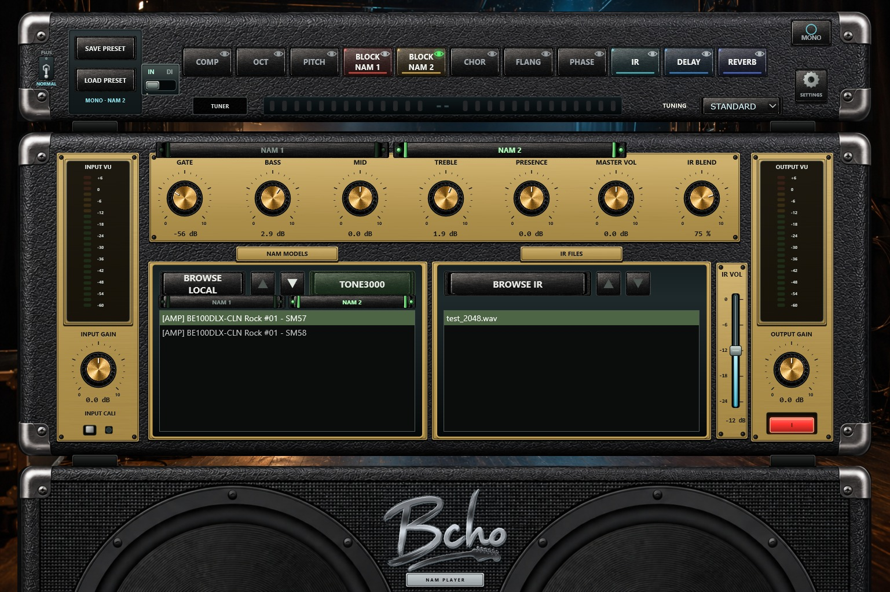

La ventana tiene tres muebles, de arriba abajo:

**1 - La tira del rack.** Bahía de presets a la izquierda, los bloques de
proceso reordenables en el centro, el botón y la pantalla del afinador, el
selector de afinación y, a la derecha, el conmutador MONO / STEREO y el engranaje
de ajustes.

**2 - La cabeza del amplificador.** Vúmetro de entrada, INPUT GAIN e INPUT CALI a
la izquierda; los siete mandos principales y, encima, los selectores de NAM e
IR; los dos navegadores de archivos (modelos NAM a la izquierda, archivos IR a
la derecha) con el fader IR VOL entre ellos y la columna de salida; vúmetro de
salida, OUTPUT GAIN y el interruptor rojo POWER a la derecha.

**3 - La pantalla acústica.** El logotipo Bcho y dos conos que se mueven con el
nivel real de salida.

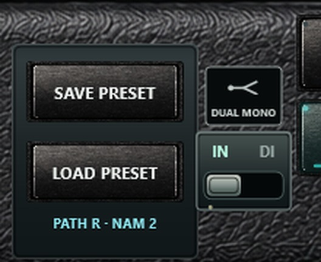

El rótulo bajo **LOAD PRESET** indica siempre qué están editando los controles
compartidos en ese momento; por ejemplo `PATH R · NAM 2`, o `MONO · NAM 1`.

---

## 4. Inicio rápido: sonido en cinco pasos

1. **Abre Audio Setup.** Pulsa el engranaje (arriba a la derecha del rack) →
   **AUDIO SETUP**. Elige driver e interfaz, marca la entrada donde tienes
   enchufada la guitarra, ajusta frecuencia de muestreo y tamaño de búfer, y
   comprueba que **MAIN / POST MASTER** apunta a las salidas de tus monitores.
2. **Carga una captura de amplificador.** Pulsa **BROWSE LOCAL** bajo NAM MODELS
   y elige un archivo `.nam` o una carpeta entera. La captura se carga, BLOCK
   NAM 2 se ilumina y el archivo aparece en la lista.
3. **Carga una pantalla.** Pulsa **BROWSE IR** y elige una respuesta impulsional
   `.wav`. El bloque IR se ilumina. (Sáltatelo si tu captura ya incluye pantalla:
   muchas capturas «amp_cab» la incluyen.)
4. **Ajusta niveles.** Toca y mira el vúmetro de entrada: busca la zona verde con
   los rasgueos más fuertes rozando el amarillo. Ajusta con INPUT GAIN. Después
   pon MASTER VOL y OUTPUT GAIN a un nivel de escucha cómodo.
5. **Toca.** Añade efectos pulsando sus bloques; doble clic abre su editor.

> Empieza con un nivel de escucha bajo y evita oír la guitarra dos veces: por la
> monitorización directa de la interfaz **y** por el reproductor.

---

## 5. Audio Setup: dispositivo, latencia y ruteo

Engranaje → **AUDIO SETUP**.

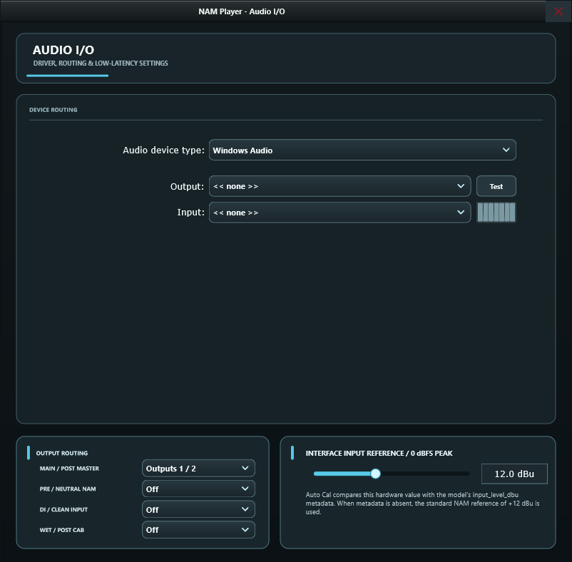

**Ruteo de dispositivo (mitad superior)**

| Control | Qué hace |
| --- | --- |
| Audio device type | La familia de driver: ASIO, Windows Audio, DirectSound (Windows); CoreAudio (macOS); ALSA/JACK (Linux). **ASIO da la latencia más baja en Windows** |
| Output | La interfaz que reproduce el sonido procesado |
| Input | La interfaz donde está conectada la guitarra |
| Canales activos | Marca el canal de entrada de la guitarra y el par de salida de tus monitores |
| Sample rate | 44,1 kHz o superior. Más frecuencia cuesta más CPU; las capturas NAM se remuestrean internamente cuando hace falta |
| Audio buffer size | El compromiso entre latencia y estabilidad. 128 o 256 muestras es un buen punto de partida |
| Control panel / Test | Abre el panel del fabricante (ASIO) y reproduce un tono de prueba |

**Ruteo de salida (abajo a la izquierda).** Cuatro tomas independientes, cada una
asignada a un par de salidas físicas o en **Off**:

| Ruta | Señal que lleva | Uso habitual |
| --- | --- | --- |
| MAIN / POST MASTER | La salida final del reproductor | Escucha y grabación del sonido definitivo |
| PRE / NEUTRAL NAM | BLOCK NAM 2 antes de tonos, efectos y pantalla | Reamplificación, comparación A/B |
| DI / CLEAN INPUT | La fuente seleccionada antes del amplificador: entrada física en IN, archivo en DI | Pista limpia de seguridad |
| WET / POST CAB | La rama procesada posterior a la pantalla | Ruta de grabación procesada aparte |

Un par solo puede usarlo una ruta: si eliges uno ya ocupado, ese selector vuelve
a **Off**. MAIN usa normalmente las salidas 1/2. Deja en Off las rutas que no
necesites para que nada se duplique.

**Interface input reference / 0 dBFS peak (abajo a la derecha).** Un deslizador
de 0 a 30 dBu. Le dice a [Input Cali](#15-input-cali-calibración-automática-de-entrada)
cuál es el nivel máximo de entrada de tu interfaz. No tiene efecto con Input Cali
desactivado.

Todo lo de esta ventana -dispositivo, canales, frecuencia, búfer, referencia y
las cuatro rutas- se guarda por máquina y se restaura en el siguiente arranque.
Deliberadamente **no** se guarda en los presets `.bnpp`, para que un preset pueda
viajar entre ordenadores.

---

## 6. Recorrido de la señal

### IN / DI: elegir la fuente (solo standalone)

La palanca grande **IN / DI** está debajo de DUAL MONO / SPLIT L/R. **IN** usa
las entradas físicas configuradas. **DI** las sustituye por archivos de audio
antes de los efectos, NAM, IR y rutas de salida existentes. La aplicación arranca
siempre en **IN**. Los cambios de fuente aplican una rampa breve para evitar clics.

Elegir DI abre la ventana modal DI PLAYER. Puedes cerrarla con **CLOSE**, el
botón de cierre o Esc; la reproducción continúa. **CONFIG DI** permite volver a
abrirla sin cambiar de fuente. La cabina y los navegadores principales quedan libres.

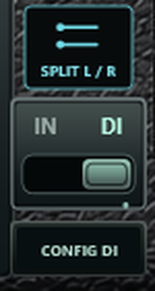

| Modo de procesamiento | Pistas DI |
| --- | --- |
| MONO | Un archivo mono alimenta la ruta izquierda activa |
| STEREO + DUAL MONO | El mismo archivo mono alimenta ambas rutas |
| STEREO + SPLIT L/R | Dos archivos mono, DI L y DI R, alimentan las rutas por separado |

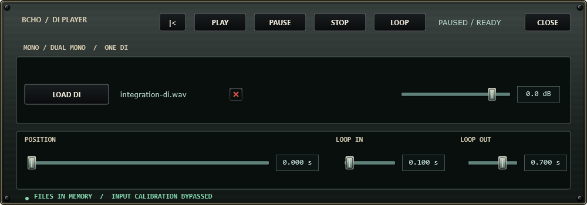
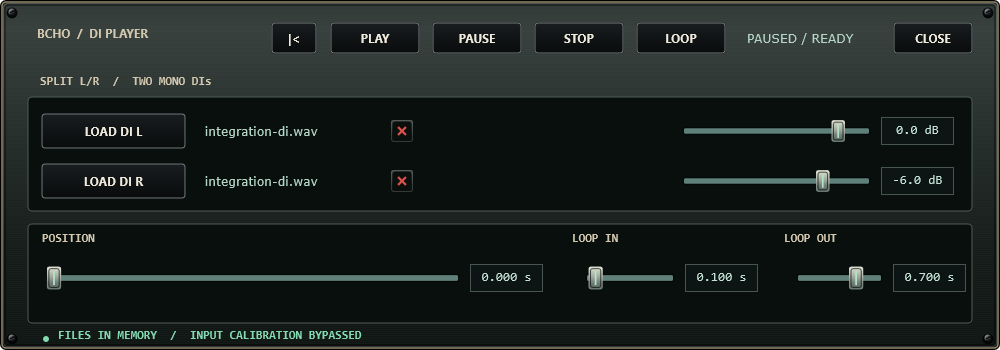

**Cargar y quitar.** Usa **LOAD DI**, **LOAD DI L** o **LOAD DI R**, o arrastra
un archivo a su fila. En SPLIT puedes soltar dos archivos juntos, uno por ruta.
Admite WAV, AIFF y FLAC, **solo mono**. Si el archivo es estéreo o multicanal,
aparece un mensaje que pide una pista mono y se conserva el archivo anterior.
La **X roja** junto al nombre descarga esa pista de la memoria, sin borrar el
archivo original. Quitar una pista pausa el transporte común y conserva la otra.

La carga se realiza en segundo plano y la reproducción desde memoria. Cada pista
puede tener una frecuencia de muestreo distinta; se adapta automáticamente a la
del dispositivo. No se aplica normalización automática. El límite es de 512 MiB
de audio decodificado por pista. Cada pista tiene un nivel propio de **-60 a
+12 dB**, inicialmente **0 dB**; el doble clic en el deslizador recupera 0 dB.
INPUT GAIN sigue disponible después de la fuente.

### Transporte DI común y bucle

El transporte con marco dorado sobre los navegadores NAM e IR solo aparece en DI.
De izquierda a derecha: **retroceder 5 segundos, PLAY, PAUSE, STOP y avanzar
5 segundos**. PLAY se ilumina durante la reproducción.


| Control de DI PLAYER | Acción |
| --- | --- |
| PLAY | Reproducir ambas pistas desde la posición común |
| PAUSE | Conservar la posición y enviar silencio a las cadenas; continúan las colas de efectos |
| STOP | Pausar y volver al inicio |
| Botón de retorno al inicio | Volver al principio sin cambiar el estado de reproducción o pausa |
| POSITION | Desplazarse con el deslizador o introducir segundos |
| LOOP | Activar o desactivar la repetición de ambas pistas |
| LOOP IN / LOOP OUT | Seleccionar los límites comunes mediante deslizadores o tiempos numéricos |

La duración total es la de la pista más larga. Una pista terminada o vacía
produce silencio; nunca recupera por sí sola la entrada física. Ambas pistas
comparten desplazamiento y bucle. Cerrar la ventana no detiene el transporte.

**Cambiar de fuente:** pasar de DI a IN pausa la DI y recupera suavemente la
entrada física. Volver a DI recupera archivos, niveles, posición y bucle, pero
**no inicia la reproducción**. Pulsa PLAY cuando quieras escucharla. La
configuración de entrada física y su calibración se conservan al usar DI.

**Calibración:** INPUT CALI específica de la interfaz queda anulada en DI,
como indica el estado del reproductor. Recupera su ajuste anterior al volver a
IN. Esto no modifica el nivel de cada archivo ni INPUT GAIN del amplificador.

**Recuperar la sesión:** un cierre normal guarda rutas de archivos, niveles,
posición y bucle. Al arrancar de nuevo la fuente es IN y la DI está pausada.
Conserva los archivos en su ubicación o vuelve a cargarlos. Los archivos DI y
su transporte quedan fuera de los presets `.bnpp`. El plugin no tiene reproductor,
selector de fuente, transporte, parámetros ni estado DI: usa las pistas del DAW.

### Orden de procesamiento y tomas de salida

Cada ruta procesa su audio en este orden:

```
fuente seleccionada: entrada física IN o archivo(s) DI
  → toma del afinador (siempre la DI sin tocar, antes de todo)
  → INPUT GAIN (+ Input Cali solo con entrada física IN)
  → GATE
  → [ bloques del rack, en el orden que se ve en pantalla ]
        ...efectos antes de BLOCK NAM 2...
        BLOCK NAM 1  (con sus propios BASS/MID/TREBLE/PRESENCE)
        BLOCK NAM 2  (después, los BASS/MID/TREBLE/PRESENCE principales)
        ...efectos entre BLOCK NAM 2 e IR...
        IR  (convolución de pantalla → IR VOL → IR BLEND)
        ...efectos después de IR...
  → MASTER VOL
  → OUTPUT GAIN
  → POWER
  → salida MAIN
Otras tomas: DI antes del procesamiento; PRE es una rama NAM neutra independiente; WET es posterior a la pantalla.
```

El esquema describe NORMAL. En PLUS la cadena NAM / IR se ejecuta en la posición de NAM 1 y se omite NAM 2; el IR general queda separado. PRE sigue siendo la rama neutra independiente del NAM 2 de NORMAL, no una toma de la cadena PLUS.

BLOCK NAM 2 e IR son **anclas**: no se pueden arrastrar, y ningún bloque puede
moverse de forma que IR quede antes de BLOCK NAM 2. Todo lo demás es libre.

---

## 7. El rack: bloques, orden y el ojo


En NORMAL, once bloques por ruta, mostrados de izquierda a derecha en orden de proceso. El
orden por defecto es COMP · OCT · PITCH · BLOCK NAM 1 · BLOCK NAM 2 · CHOR ·
FLANG · PHASE · IR · DELAY · REVERB.

**Cómo se lee un bloque**

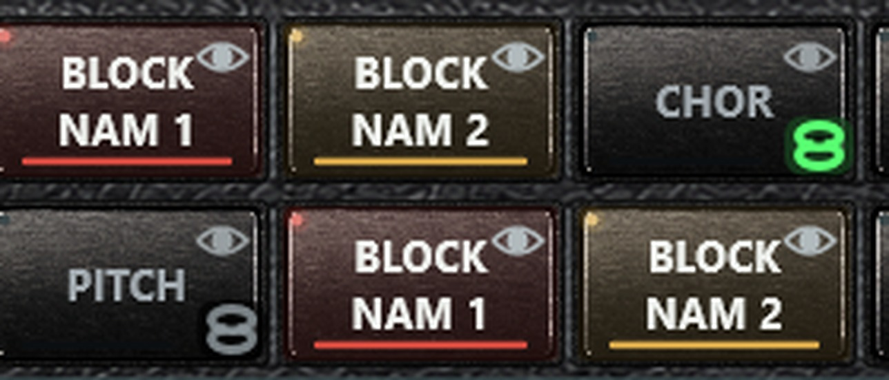

| Parte | Significado |
| --- | --- |
| Color del cuerpo | Iluminado y teñido = activado. Gris plano = en bypass |
| LED pequeño, arriba a la izquierda | Repite el estado de activación |
| Barra de color, abajo | El color identificativo del bloque, encendido mientras está activo |
| Ojo, arriba a la derecha | Elige qué bloque describen los controles compartidos y los navegadores. El bloque visualizado tiene el ojo verde |
| Cadena, abajo a la derecha | Solo en STEREO y solo en efectos: el enlace L/R. Ver el [capítulo 13](#13-enlazar-efectos-entre-l-y-r) |

**Qué hace cada clic**

| Acción | Resultado |
| --- | --- |
| Clic simple en el cuerpo | Activa o pone en bypass el bloque |
| Doble clic en el cuerpo | Efectos: abre el editor. BLOCK NAM 1 / BLOCK NAM 2: abre el selector de modelo. IR: abre el selector de IR |
| Clic en el ojo | Hace que ese bloque sea el que editan los controles compartidos. Un bloque en bypass no se puede visualizar |
| Arrastrar en horizontal | Mueve el bloque; la posición de destino se marca con un contorno blanco |
| Soltar un archivo sobre un bloque | Lo carga: `.nam` en un bloque NAM, `.wav` en el bloque IR; una carpeta carga su primer archivo válido |
| Pasar el ratón por BLOCK NAM 1 / BLOCK NAM 2 | Muestra la ficha de información de la captura |

Un bloque NAM o IR solo se puede activar cuando contiene un archivo válido.
Pulsar uno vacío mientras su archivo aún se carga significa «enciéndelo cuando
esté listo», no «invierte el estado».

---

## 8. BLOCK NAM 1 y BLOCK NAM 2

Los dos bloques admiten cualquier captura `.nam` compatible; el reproductor no
presupone qué se capturó. BLOCK NAM 1 va antes en la cadena y es el sitio natural
para una captura de pedal o previo, y BLOCK NAM 2 para un amplificador, pero nada
impide usarlos al revés.

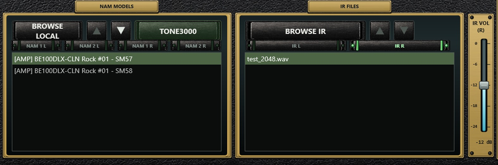

**Cómo cargar una captura**

| Vía | Cómo |
| --- | --- |
| BROWSE LOCAL | Elige un `.nam` o una carpeta. Una carpeta añade a la lista todas sus capturas y selecciona la primera. Marca **DEEP SEARCH** en el diálogo para incluir subcarpetas |
| La lista | Pulsa cualquier fila para cargarla; los botones ▲ / ▼ recorren la lista y se apagan en los extremos |
| TONE3000 | Abre la biblioteca en línea dentro del reproductor; ver el [capítulo 16](#16-tone3000-dentro-del-reproductor) |
| Arrastrar y soltar | Suelta un `.nam` o una carpeta sobre la lista o directamente sobre el bloque |
| Doble clic en el bloque | Abre el selector de archivos de ese bloque |

Cada bloque recuerda su propia carpeta, su ajuste de búsqueda profunda, su lista
y su selección, por ruta. Elegir una captura para BLOCK NAM 2 devuelve además los
controles de esa ruta a valores seguros y enciende el bloque; la selección de
pantalla no se toca.

**La arquitectura es automática.** El reproductor identifica NAM A1, A2 Standard
y A2 Nano, y despacha los modelos A2 por la vía rápida de NAM Core. No hay
conmutador manual. Si un archivo no es un NAM válido de una entrada y una salida,
la carga se rechaza y el bloque se queda como estaba.

**La ficha de información de la captura.** Al pasar el ratón por un bloque NAM o
por cualquier fila de la lista aparecen los metadatos escritos en la cabecera del
`.nam` -título, marca y modelo del equipo, quién lo modeló, tipo de equipo,
arquitectura, frecuencia de muestreo y nivel de referencia de entrada- además de
la carátula cuando existe.

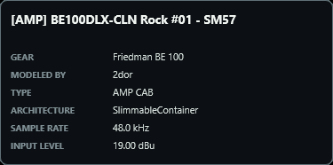

La carátula es cualquier imagen que esté junto a la captura con el mismo nombre
base (`Mi Captura.nam` → `Mi Captura.png`, `.jpg`, `.jpeg` o `.webp`). Las
descargas de TONE3000 la guardan solas; para tus propias capturas, basta con
dejar una imagen al lado. Solo se lee la cabecera del archivo, así que recorrer
una lista larga con el ratón no cuesta nada.

**Cargar BLOCK NAM 1.** Selecciona su pestaña NAM para dirigir el navegador, o haz doble clic en su bloque del rack para elegir el origen de la captura:

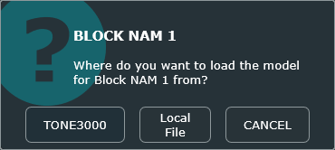

### NORMAL / PLUS: cadenas NAM e IR

El interruptor de palanca del extremo izquierdo del rack elige entre dos formas
de usar las capturas NAM:

| Posición | Qué muestra el rack |
| --- | --- |
| NORMAL (palanca abajo) | BLOCK NAM 1 y BLOCK NAM 2, tal como se describe arriba |
| PLUS (palanca arriba) | Un único bloque **NAM / IR** grande, del doble de ancho, en el lugar de BLOCK NAM 1 dentro de la cadena |

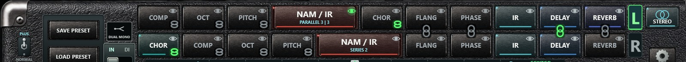

El bloque NAM / IR de PLUS ejecuta una **cadena** de bloques NAM e IR de pantalla. Se enciende y apaga
con un clic y tiene el ojo como cualquier otro bloque NAM; la línea bajo su nombre
resume la cadena, por ejemplo `SERIES 2` o `PARALLEL 2 | 1`. **Haz doble clic** sobre
él para abrir la ventana PLUS CHAIN:

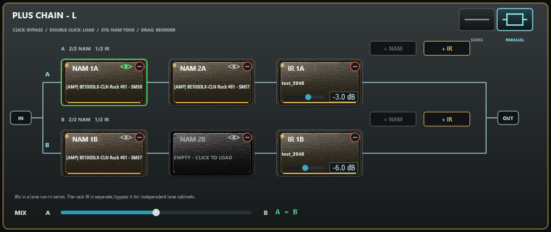

| Elemento | Uso |
| --- | --- |
| Conmutador de línea simple / líneas paralelas | **SERIES**: una sola ruta de IN a OUT. **PARALLEL**: dos rutas, A arriba y B abajo, alimentadas con la misma entrada y mezcladas de nuevo |
| NAM 1A / 2A e IR 1A / 2A (igual en B) | Máximo dos NAM y dos IR por línea. Cada línea conserva un bloque NAM. El audio sigue el orden mostrado |
| Clic en un bloque | Encender / apagar (un bloque vacío abre el menú de carga en su lugar) |
| Doble clic o clic derecho | NAM: cargar captura local o desde TONE3000. IR: cargar WAV, AIFF o FLAC local. Remove block aparece cuando se permite quitar el bloque |
| Soltar un archivo | `.nam` sobre una tarjeta NAM o + NAM; WAV, AIFF o FLAC sobre una tarjeta IR o + IR |
| Ojo (solo tarjetas NAM) | Elegir el bloque NAM que editan BASS, MID, TREBLE y PRESENCE y en el que carga la lista NAM MODELS o TONE3000 |
| `-` (esquina superior derecha) | Eliminar el bloque, previa confirmación. El último NAM de cada línea no se puede quitar; todos los IR se pueden quitar |
| **+ NAM / + IR** | Añadir el tipo elegido; cada botón se desactiva al alcanzar dos bloques de ese tipo. Los nuevos NAM se insertan antes de los IR |
| Nivel del IR | De -24 a +12 dB, inicialmente 0 dB; doble clic para restablecer. WAV, AIFF y FLAC mono o estéreo promediado a mono; hasta 8192 muestras de origen, remuestreadas sin normalización |
| Arrastrar un bloque | Cambiarlo de posición, también a la otra ruta (si respeta los límites de dos NAM y dos IR) |
| MIX A - B (solo PARALLEL) | Mezcla lineal: centro al 50% de cada línea; extremos al 100% de A o B. A diferencia de PAN, el centro no conserva ambas líneas a nivel completo |

Cada bloque NAM de la cadena tiene su propia captura, su interruptor y sus controles
de tono, igual que BLOCK NAM 1 y BLOCK NAM 2. En PLUS los selectores NAM sobre la
placa de tono y sobre la lista pasan a ser uno por ruta, con el nombre del bloque
que se edita (`NAM 2A`), y la lista muestra los modelos NAM de ese bloque.

La primera vez que se activa PLUS, las capturas NORMAL cargadas se copian a la línea A en orden de rack, con sus ajustes de bypass y tono. Si no hay capturas, queda un bloque NAM vacío. El IR general no se copia a las líneas. NORMAL y PLUS guardan ajustes separados: al volver a
NORMAL, BLOCK NAM 1 y BLOCK NAM 2 están exactamente como estaban. El interruptor,
las cadenas y sus capturas se guardan con la sesión, en los presets (el paquete
`.bnpp` incluye todas las capturas e IR de la cadena) y, en el plugin, con el proyecto
del DAW. Todo cambio de la cadena se aplica tras un breve fundido, sin clics. Con
INPUT CALI activado, PLUS calibra según el primer NAM activo de la línea A; la reproducción DI del standalone anula esa calibración de interfaz.

Los IR de una línea se procesan en serie. Para mezclar dos pantallas, coloca una en cada línea paralela y usa A/B MIX. El IR del rack sigue siendo un bloque compartido independiente: ponlo en bypass si utilizas pantallas por línea para evitar filtrar dos veces. Los IR se cargan en segundo plano y guardan nivel, orden y bypass con la cadena. Las cadenas antiguas con más de dos NAM por línea restauran los dos primeros y muestran un aviso; conserva el preset original si necesitas recuperar la configuración anterior.

---

## 9. Respuestas impulsionales de pantalla

**BROWSE IR** carga una respuesta `.wav`, o una carpeta: el reproductor se queda
con los archivos WAV cortos que sirven como respuesta impulsional, los lista y
selecciona el primero. Si no encuentra ninguno válido, avisa con **IR not found**.

- Se aceptan respuestas mono y estéreo; un archivo estéreo se suma a mono.
- Se usan hasta 8192 muestras, remuestreadas a la frecuencia del dispositivo.
- **Se conserva la ganancia original: las IR nunca se normalizan.**
- Pulsa otra vez la fila seleccionada para deseleccionarla: se borra la respuesta
  y el bloque IR queda en bypass.
- **DELETE** borra la respuesta seleccionada de la carpeta de IR, tras preguntar.
- Cargar o cambiar una respuesta se hace con fundido cruzado, así que no chasquea.

Dos controles dan forma a la pantalla:

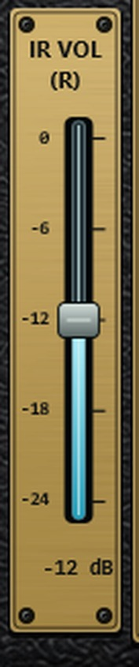

- **IR BLEND** mezcla la señal sin convolución de pantalla con la señal
  convolucionada, de 0 a 100 %.
- **IR VOL** (el fader vertical) ajusta el nivel de la rama de pantalla,
  **de -24 dB a 0 dB**, con **-12 dB** por defecto para dejar margen a las
  capturas con mucho nivel. El valor actual se imprime bajo la escala.

---

## 10. Los mandos, uno a uno

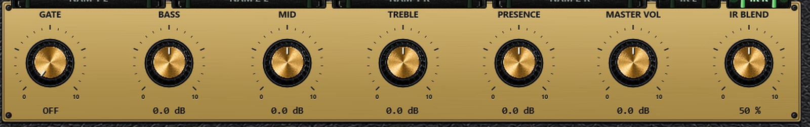

**Cómo se usa un mando**: arrastra en vertical u horizontal; el valor exacto se
imprime debajo. **Doble clic restaura el valor por defecto**: las 12 en punto en
todos menos GATE, que vuelve al extremo izquierdo (OFF).

| Control | Rango | Por defecto | Notas |
| --- | --- | --- | --- |
| INPUT GAIN | -12 … +12 dB | 0.0 dB | Nivel hacia la cadena NAM; Input Cali se suma en IN físico; queda anulado con archivos DI |
| GATE | OFF … umbral de -80 a 0 dB | OFF | En el extremo izquierdo es bypass real. Ataque 1,5 ms, retención 35 ms, caída 90 ms, histéresis de 3 dB |
| BASS | ±12 dB @ 70 Hz | 0.0 dB | Campana, Q 0,72 |
| MID | ±12 dB @ 750 Hz | 0.0 dB | Campana, Q 0,72 |
| TREBLE | ±12 dB @ 4 kHz | 0.0 dB | Campana, Q 0,72 |
| PRESENCE | ±12 dB @ 6 kHz | 0.0 dB | Campana, Q 0,72 |
| MASTER VOL | -12 … +12 dB | 0.0 dB | Después de la cadena, antes de Output Gain |
| IR BLEND | 0 … 100 % | 50 % | Seco frente a pantalla |
| IR VOL | -24 … 0 dB | -12 dB | Solo la rama de pantalla |
| OUTPUT GAIN | -12 … +12 dB | 0.0 dB | Nivel final |
| POWER | Encendido / apagado | Encendido | Enmudece la ruta procesada; el interruptor brilla en rojo encendido |
| INPUT CALI | Encendido / apagado | Apagado | Ver el [capítulo 15](#15-input-cali-calibración-automática-de-entrada) |

**La sección de tonos sigue al bloque NAM seleccionado.** Con un selector
**NAM 1** activo, BASS / MID / TREBLE / PRESENCE controlan los cuatro filtros
propios de BLOCK NAM 1; con un selector **NAM 2** activo controlan la sección de
tonos principal. Cada juego guarda sus propios valores y cambiar de selector los
recupera. En STEREO la placa imprime cuál estás editando.

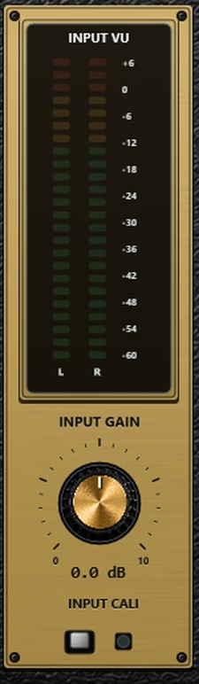
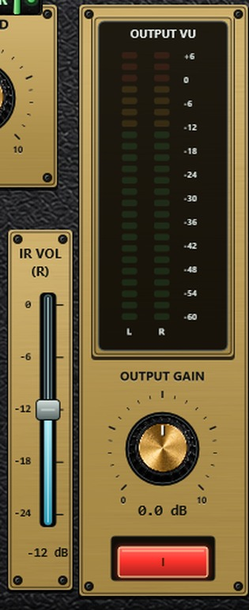

---

## 11. Los ocho efectos al detalle

Cada efecto ofrece **tres algoritmos** y **seis parámetros**. Doble clic en un
bloque abre su editor; cada mando muestra una unidad real y el doble clic sobre
un mando restaura su valor por defecto.


El interruptor **ACTIVE** de la esquina superior derecha del editor es el mismo
bypass que pulsar el bloque. **TYPE** elige el algoritmo. Los cambios de
parámetro, algoritmo y bypass se suavizan, las lecturas de la familia del delay
se interpolan y la realimentación está acotada, así que nada chasquea ni se
dispara.

### COMP - compresor
Algoritmos: **Studio VCA**, **Optical**, **FET Punch**.

| Parámetro | Rango | Por defecto |
| --- | --- | --- |
| Threshold | -55 … -2 dB | -31.2 dB |
| Ratio | 1 … 20 :1 | 7.7:1 |
| Attack | 1 … 100 ms | 15.9 ms |
| Release | 20 … 600 ms | 223 ms |
| Makeup | -12 … +12 dB | 0.0 dB |
| Mix | 0 … 100 % | 100 % |

### DELAY
Algoritmos: **Digital Studio**, **Tape Echo**, **Analog BBD**.

| Parámetro | Rango | Por defecto |
| --- | --- | --- |
| Time | 20 … 1200 ms | 398 ms |
| Feedback | 0 … 92 % | 32 % |
| Mix | 0 … 100 % | 28 % |
| Tone | 0 … 100 % | 65 % |
| Mod | 0 … 100 % | 8 % |
| Level | -12 … +12 dB | 0.0 dB |

### CHOR - chorus
Algoritmos: **Studio**, **Ensemble**, **Tri-Chorus**.

| Parámetro | Rango | Por defecto |
| --- | --- | --- |
| Rate | 0,05 … 5 Hz | 1.24 Hz |
| Depth | 0,5 … 20 ms | 10.3 ms |
| Mix | 0 … 100 % | 35 % |
| Delay | 4 … 30 ms | 11.8 ms |
| Feedback | -65 … +65 % | 0 % |
| Level | -12 … +12 dB | 0.0 dB |

### FLANG - flanger
Algoritmos: **Analog**, **Through-Zero**, **Jet**.

| Parámetro | Rango | Por defecto |
| --- | --- | --- |
| Rate | 0,03 … 2,5 Hz | 0.57 Hz |
| Depth | 0,1 … 9 ms | 5.0 ms |
| Mix | 0 … 100 % | 35 % |
| Feedback | -85 … +85 % | 20 % |
| Manual | 0,2 … 5 ms | 1.4 ms |
| Level | -12 … +12 dB | 0.0 dB |

### PHASE - phaser
Algoritmos: **4 Stage**, **8 Stage**, **12 Stage**.

| Parámetro | Rango | Por defecto |
| --- | --- | --- |
| Rate | 0,03 … 4 Hz | 0.82 Hz |
| Depth | 0 … 100 % | 70 % |
| Mix | 0 … 100 % | 40 % |
| Feedback | -75 … +75 % | 12 % |
| Centre | 180 … 2200 Hz | 887 Hz |
| Level | -12 … +12 dB | 0.0 dB |

### REVERB
Algoritmos: **Studio Room**, **Plate**, **Concert Hall**.

| Parámetro | Rango | Por defecto |
| --- | --- | --- |
| Size | 0 … 100 % | 55 % |
| Damping | 0 … 100 % | 50 % |
| Mix | 0 … 100 % | 25 % |
| Width | 0 … 100 % | 80 % |
| Freeze | OFF / ON | OFF |
| Level | -12 … +12 dB | 0.0 dB |

### OCT - octavador
Algoritmos: **Poly Clean**, **Classic Mono**, **Organ**.

| Parámetro | Rango | Por defecto |
| --- | --- | --- |
| Oct Down | 0 … 100 % | 45 % |
| Oct Up | 0 … 100 % | 0 % |
| Dry | 0 … 100 % | 80 % |
| Tone | 0 … 100 % | 50 % |
| Tracking | 0 … 100 % | 65 % |
| Level | -12 … +12 dB | 0.0 dB |

### PITCH - transpositor
Algoritmos: **Studio**, **Low Latency**, **Vintage**.

| Parámetro | Rango | Por defecto |
| --- | --- | --- |
| Semitones | -12 … +12 st | 0.0 st |
| Mix | 0 … 100 % | 100 % |
| Window | 20 … 120 ms | 65 ms |
| Feedback | 0 … 55 % | 0 % |
| Fine | -100 … +100 ct | 0 ct |
| Level | -12 … +12 dB | 0.0 dB |


#### HARMONIZER (armonía según la escala)


La franja inferior de la ventana de PITCH convierte el bloque en un armonizador
inteligente. Con **HARMONIZER** activado, cada nota que tocas recibe una segunda
voz a un intervalo de la escala, de modo que la armonía siempre está en tono:

| INTERVAL | Segunda voz |
| --- | --- |
| OCTAVE UP / OCTAVE DOWN | Siempre una octava; no necesita tonalidad, suena desde la primera nota y funciona también con acordes |
| THIRD UP / THIRD DOWN | La tercera de la escala: **mayor o menor según la nota**. En Do mayor, Do recibe Mi (tercera mayor) y Re recibe Fa (tercera menor); en Do menor, Do recibe Mib |
| FIFTH UP / FIFTH DOWN | La quinta de la escala: justa, o disminuida sobre el séptimo grado (Si -> Fa en Do mayor) |

**KEY y SCALE.** Con KEY en **AUTO** la tonalidad se aprende de las notas que tocas:

- Trabaja sobre las siete notas en uso, que es lo que decide la armonía. Una
  tonalidad se distingue de su homónima (Do mayor / Do menor) por las notas que
  realmente suenan (Mi o Mib, La o Lab, Si o Sib); una tonalidad, su relativa y sus
  modos (Do mayor, La menor, Re dórico...) comparten notas y por tanto armonía.
- La tónica y el modo se nombran según dónde se detiene lo que tocas y, sobre
  todo, dónde reposan las frases: el visor puede indicar `A MINOR`, `D DORIAN`,
  `G MIXOLYDIAN`... Tocar en pentatónica se interpreta como menor / mayor natural
  hasta que otras notas digan lo contrario. La **menor armónica** se reconoce cuando
  la séptima elevada se usa de forma constante (Sol# y nunca Sol en La menor): la
  dominante recibe entonces su tercera mayor.
- Trabajan dos memorias a la vez: una larga mantiene estable la tonalidad y una
  corta sigue un cambio real de tonalidad en pocos segundos. Una nota de paso
  nunca cambia la tonalidad.
- Hasta haber oído suficientes notas el visor muestra **LISTENING...** y las
  terceras y quintas no suenan, así que nunca se añade una nota equivocada. La
  barra bajo la tonalidad indica lo segura que es la detección.

Elige una tónica en **KEY** para fijar tú la tonalidad; **SCALE** ofrece entonces
mayor, menor, los otros cinco modos, menor armónica y menor melódica.

**TUNING.** **PURE** afina cada intervalo respecto a la nota tocada con proporciones
simples (terceras 5:4 y 6:5, quintas 3:2): las dos voces encajan sin batidos, que es
lo que mantiene limpia una armonía a través de un ampli saturado. **TEMPERED** usa
los semitonos iguales del piano, para coincidir exactamente con teclados.

**La voz.** La armonía la genera un desplazador propio cuyos empalmes se
sincronizan con el periodo de la nota que suena, de modo que suena a segunda
guitarra y no a efecto. Lee la guitarra con unos milisegundos de retraso -el
retraso natural de un segundo músico- y usa ese tiempo para conocer cada nota nueva
antes de que suene: una nota nunca sale con el intervalo de la anterior. Las notas
se reconocen desde el Mi grave (y afinaciones drop) hasta el traste 24, con un
error de pocos cents, en unos 25 ms (45 ms en las cuerdas más graves). Los bendings
y el vibrato se siguen de forma continua: en un bending de Do a Re en Do mayor la
armonía se desliza de Mi a Fa. Las notas fuera de la tonalidad (una blue note, el
Sol# de La menor) toman el grado de la escala que da una tercera o quinta real:
Sol# recibe Si, Sib en Do mayor recibe Re.

**Mandos en modo HARMONIZER**: **MIX** equilibra la armonía con la nota que tocas,
que siempre se mantiene (100 % = las dos al mismo nivel, 0 % = sin armonía);
**FINE** desafina ligeramente la armonía para un sonido más ancho; **LEVEL** funciona
como siempre. SEMITONES, WINDOW y FEEDBACK descansan. TYPE elige el carácter de la
voz: **Studio**, **Low Latency** (menos retraso; en frases muy rápidas puede perder
algo de precisión en notas graves) y **Vintage** (más oscura). El bloque del rack
indica **HARMONY** mientras el armonizador está activo.

Toca notas sueltas: las terceras y quintas siguen melodías, riffs y solos. Los
acordes confunden cualquier detección de nota, así que simplemente suenan sin
armonía. La detección usa la señal limpia de la guitarra, antes de la ganancia, el
NAM y los efectos. Los ajustes de HARMONIZER se guardan con el bloque PITCH y
siguen un enlace L / R.

---

## 12. MONO y STEREO: dos equipos completos

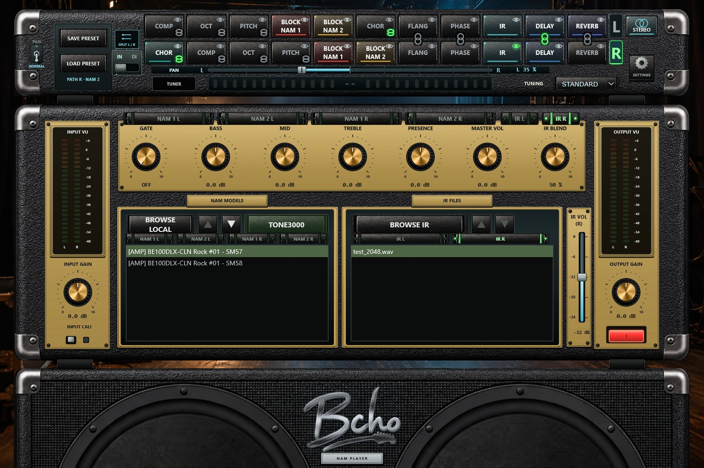

**MONO / STEREO** (arriba a la derecha del rack) alterna entre una y dos rutas
audibles.

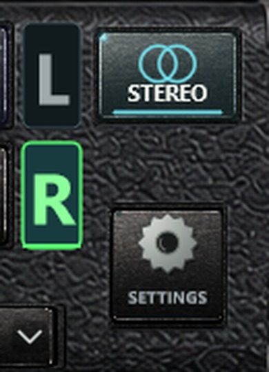

- **MONO**: la entrada de la interfaz se suma a la cadena izquierda y su
  resultado alimenta los dos canales de cada par de salida ruteado. Se ocultan
  los selectores de la derecha, la segunda fila del rack y el conmutador de
  entrada.
- **STEREO**: funcionan las dos cadenas. Aparecen dos filas de rack, los vúmetros
  se dividen en L y R, y las pestañas `L` / `R` junto a los racks eligen qué ruta
  editan los controles compartidos.

**DUAL MONO / SPLIT L/R** (junto a la bahía de presets, solo en STEREO):

| Posición | Tratamiento de la entrada |
| --- | --- |
| DUAL MONO | La entrada sumada de la interfaz alimenta **las dos** cadenas: una guitarra por dos equipos independientes |
| SPLIT L/R | El canal de entrada 1 alimenta la cadena izquierda y el canal 2 la derecha |

Este ajuste pertenece al estado de la aplicación, no a los presets. La tabla describe IN físico. En DI, MONO y DUAL MONO usan el archivo izquierdo; SPLIT L/R usa un archivo por ruta (capítulo 6).

**PAN** (la barra entre las dos filas del rack y el afinador, solo en STEREO):
un fader horizontal que reparte el nivel entre las dos rutas.

| Posición | Resultado |
| --- | --- |
| Centro (`CENTER`, muesca central, marca verde) | L y R suenan a su nivel completo, igual que sin PAN |
| Hacia `L` | La ruta derecha se atenúa progresivamente; en el tope izquierdo (`L 100 %`) solo suena L |
| Hacia `R` | La ruta izquierda se atenúa progresivamente; en el tope derecho (`R 100 %`) solo suena R |

Las letras `L` y `R` de los extremos son testigos: la del lado que se atenúa se
va apagando, y el carril se ilumina desde el centro hacia el lado favorecido.
Ningún lado sube nunca por encima de su nivel en el centro. Doble clic devuelve
el fader al centro; la rueda del ratón lo mueve en pasos finos.

En el standalone PAN actúa sobre las salidas principal y WET (las tomas PRE y DI
quedan intactas) y se guarda con el estado de la aplicación y en los presets.

**Los selectores.**

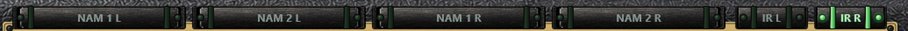

| Selector | Elige |
| --- | --- |
| `NAM 1 L` `NAM 2 L` `NAM 1 R` `NAM 2 R` | El bloque NAM sobre el que actúan los controles de tono y el navegador de NAM |
| `IR L` `IR R` | La pantalla sobre la que actúan IR BLEND e IR VOL |
| Pestañas `L` / `R` | La ruta sobre la que actúa cualquier otro control compartido |

**Qué sigue cada control**

| Control | Sigue a |
| --- | --- |
| INPUT GAIN, GATE, MASTER VOL, OUTPUT GAIN, POWER, INPUT CALI, TUNER | la **ruta** seleccionada |
| BASS, MID, TREBLE, PRESENCE | el **bloque NAM** seleccionado de esa ruta (NAM 1 tiene el suyo) |
| IR BLEND, IR VOL | la **pantalla** seleccionada |
| Afinación de referencia, acabado, Audio Setup, ruteo, actualizaciones | toda la aplicación |

En MONO solo se muestran los dos selectores izquierdos, y el rótulo IR VOL pierde
el sufijo `(L)` / `(R)`.

---

## 13. Enlazar efectos entre L y R

En STEREO puedes fijar un efecto de la cadena izquierda al mismo efecto de la
derecha, para ajustarlo una sola vez.


- **Dónde está el icono.** Cuando los dos bloques están en la misma columna, un
  icono de cadena se sitúa en la junta entre las dos filas del rack y los une. Si
  mueves uno y el par deja de compartir columna, el icono pasa a la **esquina
  inferior derecha de cada bloque**: funciona exactamente igual.
- **Color.** Verde = enlazado. Gris = no enlazado.
- **Clic para enlazar o desenlazar.**
- **Qué se comparte:** el algoritmo y los seis parámetros. Editar cualquiera de
  los dos bloques cambia ambos.
- **Qué no se comparte:** el interruptor de activación y la posición en la
  cadena. Los dos bloques pueden estar activos, ninguno, o uno sí y otro no:
  enlazar nunca los toca.
- **Enlazar dos bloques con ajustes distintos** pregunta qué lado conservar:

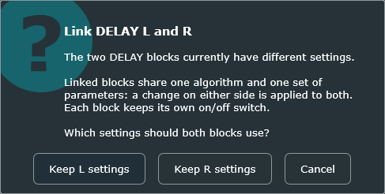

- **Desenlazar** deja los dos bloques exactamente como suenan en ese momento; a
  partir de ahí se editan por separado.
- **BLOCK NAM 1, BLOCK NAM 2 e IR no se pueden enlazar.**
- Los enlaces se guardan con la sesión y dentro de los presets `.bnpp` de dos
  rutas.

---

## 14. Afinador

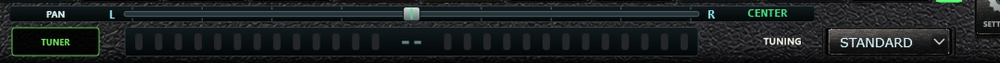

Pulsa **TUNER**; las letras se iluminan en verde y el botón se ve pulsado. La
pantalla muestra la nota detectada con una indicación de LED a izquierda y
derecha para bajo, centrado o alto.

- El afinador escucha la **DI sin tocar**, antes de la puerta, los bloques NAM y
  los efectos, y no forma parte del orden arrastrable.
- Rango aproximado de **65 a 700 Hz**, a cualquier frecuencia de muestreo de 44,1
  a 192 kHz.
- Dentro de **±5 cents** la pantalla indica centrado y se pone verde; más allá de
  unos 40 cents se pone roja.
- **TUNING** ofrece **STANDARD**, **DROP D**, **D STANDARD**, **Eb** y
  **OPEN G**.
- Toca una sola cuerda aislada con buen nivel y deja que la nota anterior se
  apague.

---

## 15. Input Cali (calibración automática de entrada)

La fuente DI anula temporalmente la calibración de interfaz; al volver a IN se recupera su ajuste anterior.

Las capturas NAM se entrenan a un nivel de entrada conocido. Input Cali ajusta tu
interfaz a ese nivel para que una captura suene como se capturó.

Con Input Cali activo, el reproductor calcula:

```
ganancia de calibración (dB) = referencia de entrada de la interfaz (dBu) - referencia de entrada del NAM (dBu)
```

- El valor de la interfaz es el deslizador de
  [Audio Setup](#5-audio-setup-dispositivo-latencia-y-ruteo).
- El valor del NAM viene de los metadatos `input_level_dbu` de la captura.
- Si una captura no tiene metadatos, se asume la referencia NAM estándar de
  **+12 dBu**.
- El resultado se limita a **-24 … +24 dB** y se aplica antes de los bloques NAM.
- El LED pequeño junto a INPUT CALI está verde mientras está activo.
- Mientras una captura de sustitución se está cargando, se mantiene la ganancia
  de la captura en curso: nunca salta a 0 dB en mitad de una nota.

Input Cali solo cambia ganancia. Nunca reescribe ni normaliza un modelo. Si tu
interfaz tiene varios modos de entrada (instrumento / línea / atenuador),
introduce el valor en dBu del modo que estés usando realmente. Consulta la especificación del fabricante para ese modo de entrada.

---

## 16. TONE3000 dentro del reproductor

**TONE3000** (botón verde sobre la lista de NAM) abre la biblioteca de capturas
en línea en una ventana del reproductor.

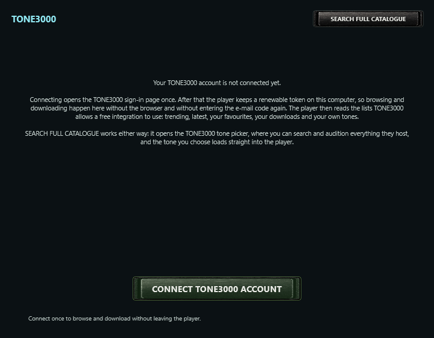

**Conectar una sola vez.** El primer uso pide conectar tu cuenta. TONE3000 inicia
sesión con un enlace por correo, así que eso abre su página de acceso una vez; el
reproductor guarda después el token de refresco devuelto, cifrado con una clave
derivada de esta máquina, en `tone3000.session` junto a la aplicación. Cada
listado y descarga posterior intenta renovar el token en silencio. Si la autorización caduca o se revoca, vuelve a conectar la cuenta. **SIGN OUT** borra el archivo.


**Navegar y preescuchar.**

| Elemento | Qué hace |
| --- | --- |
| TRENDING · LATEST · FAVOURITES · DOWNLOADED · MINE | Los cinco listados que puede leer una integración del nivel gratuito |
| Seleccionar una fila | **Carga la captura en el bloque NAM actual al instante.** La primera captura del tone se descarga y suena en cuanto está en disco; el resto del tone y su carátula siguen descargándose en segundo plano |
| Seleccionar otra fila | Cancela lo que quede descargando y preescucha la nueva |
| Un tone que ya habías descargado | Se carga al instante desde tu carpeta de descargas |
| Filas marcadas **IR only - no NAM** | Solo contienen respuestas impulsionales; no hay nada que cargar en un bloque NAM, así que no se preescuchan |
| RESTORE PREVIOUS MODEL | Devuelve la captura que tenía el bloque **antes de abrir esta ventana**. Desactivado si el bloque estaba vacío |
| Cerrar la ventana | Conserva la última captura preescuchada |
| PREV / NEXT | Paginación |
| El indicador giratorio y la línea de estado | Muestran el progreso: *Downloading tone (n / m)* y después *Playing &lt;captura&gt;* |
| SEARCH FULL CATALOGUE | Abre el buscador propio de TONE3000, con búsqueda y audición, dentro del reproductor. Al elegir un tone el buscador se cierra solo y empieza la descarga |
| SIGN OUT | Olvida la cuenta en este ordenador |

Las descargas se guardan en tu carpeta de descargas de TONE3000, una carpeta por
tone, con la carátula junto a cada captura para que la ficha pueda mostrarla.

**WebView2 (solo Windows).** El acceso integrado y el buscador del catálogo usan
Microsoft WebView2, que viene de serie en Windows 11 y con Edge en Windows 10. Si
falta o no está disponible, el reproductor ofrece una descarga oficial de
Microsoft, tu navegador externo o cancelar: **nunca se instala nada
automáticamente** y el paquete no incluye ningún instalador de Microsoft. El
audio y los archivos locales no necesitan WebView2. macOS usa WKWebView y Linux
recurre al navegador del sistema. Los navegadores externo e integrado no
comparten cookies, así que una sesión creada con una versión anterior puede
requerir un acceso dentro del reproductor.

---

## 17. Presets portables `.bnpp`

**SAVE PRESET** escribe un archivo autocontenido con **las dos rutas**:

- la captura de BLOCK NAM 2 de cada ruta;
- la captura de BLOCK NAM 1 de cada ruta, si está cargada;
- la IR general seleccionada de cada ruta, si está cargada;
- el modo NORMAL / PLUS y todos los archivos NAM e IR de PLUS, orden de líneas, bypass, tono, nivel IR y mezcla A/B;
- orden del rack, algoritmos, todos los parámetros de efecto y cada estado de
  bypass;
- todos los mandos del amplificador, interruptores y ajustes del afinador (no el reproductor DI);
- los enlaces de efectos L/R.

Los recursos incrustados se verifican con SHA-256 al cargarlos, se extraen a la
caché de presets de la aplicación y se restauran. El dispositivo de audio, la
referencia de interfaz, ruteo físico, archivos DI y transporte DI quedan fuera a propósito, para que un
preset pueda moverse entre ordenadores.

**LOAD PRESET** lo restaura. Un preset escrito por el reproductor de una sola
ruta, o por NAM PLAYER DUAL, se carga en la **ruta seleccionada**. Un preset
escrito aquí incluye una representación compatible de la ruta izquierda. Un reproductor antiguo no puede reproducir funciones que no implemente, como la cadena PLUS actual; usa 1.8.0 para recuperar la configuración completa.

> Para guardar desde NORMAL, carga BLOCK NAM 2 en la ruta izquierda. PLUS también permite guardar con un archivo cargado en su cadena izquierda. Los archivos DI nunca se incrustan.

---

## 18. Qué se recuerda y dónde

**El estado de sesión** se escribe al cerrar con normalidad y se restaura en el
siguiente arranque: las dos rutas, todos los controles, las capturas e IR
seleccionadas, el orden de bloques y los bypass, los enlaces, MONO/STEREO, DUAL
MONO/SPLIT, el acabado, el dispositivo de audio, los canales, la frecuencia, el
búfer, la referencia de interfaz y las cuatro rutas de salida. También se recuperan las cadenas PLUS y las rutas de archivos DI, niveles, posición y bucle. El selector siempre arranca en IN y la DI pausada; volver a DI no inicia la reproducción.

| Archivo | Dónde | Qué guarda |
| --- | --- | --- |
| `NAM_A2_HEAD.xml` | Junto a la aplicación si esa carpeta permite escritura; si no, en la carpeta de datos del usuario | La sesión |
| `tone3000.session` | La misma carpeta | El token de refresco cifrado de TONE3000 |
| `Presets` / `PresetCache` | La misma carpeta | Los presets que guardas y los recursos extraídos de los que cargas |
| Carpeta de datos del usuario | Windows `%APPDATA%\Bcho\BchoNAMPlayerDual`, macOS `~/Library/Application Support/Bcho/…`, Linux `~/.config/Bcho/…` | Se usa cuando la carpeta de la aplicación es de solo lectura (paquetes macOS, AppImage) |

Los archivos NAM e IR se referencian por ruta de disco, no se copian dentro de la
sesión: mantenlos donde estaban al guardar. Los presets, en cambio, los
incrustan.

---

## 19. Ajustes, acabados, actualizaciones y apoyo

Pulsa el engranaje a la derecha del rack.

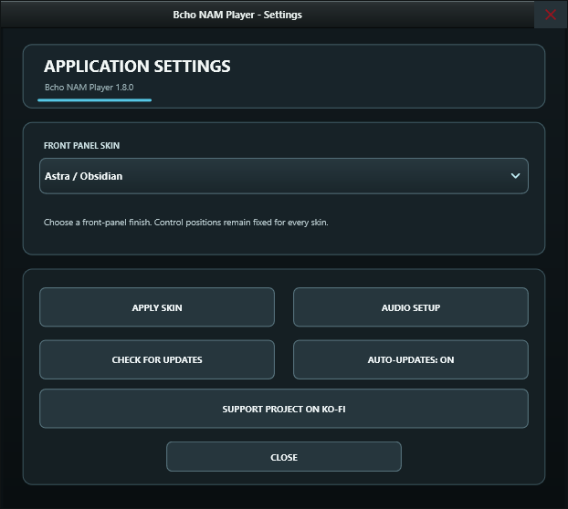

| Control | Qué hace |
| --- | --- |
| FRONT PANEL SKIN | Previsualiza un acabado al instante |
| APPLY SKIN | Hace permanente el acabado previsualizado. Cerrar sin aplicar restaura el anterior |
| AUDIO SETUP | Abre el [Audio Setup](#5-audio-setup-dispositivo-latencia-y-ruteo) |
| CHECK FOR UPDATES | Compara tu versión con la última publicada |
| AUTO-UPDATES: ON / OFF | Si esa comprobación se hace también al arrancar |
| SUPPORT PROJECT ON KO-FI | Abre `ko-fi.com/bchosoft` en tu navegador |
| CLOSE | Cierra la ventana |

**Los once acabados**: Astra / Obsidian · Tribal / Etched Titanium · Skulls /
Bone & Carbon · Hippie / Sunset Paisley · Graffiti / Electric Ink · Purple
Velvet / Amethyst · Stainless Steel / Precision · Ripped Black Denim / Roadworn ·
Blue Denim / Indigo · Spiderwebs / Black Widow · Classic Black / Levant Tolex.
Todos usan la misma geometría, así que ningún control se mueve; solo cambian
materiales, diseño de mandos y contraste de los rótulos. El plugin usa siempre
Astra / Obsidian.


La comprobación de actualizaciones solo informa de la disponibilidad y abre la
página de descarga si se lo pides. Nunca sustituye archivos, modelos ni presets.

---

## 20. Vúmetros y conos animados

**INPUT VU** muestra el nivel entrante y **OUTPUT VU** el nivel final procesado,
de +6 a -60 dB. En STEREO cada vúmetro se divide en una columna L y otra R.

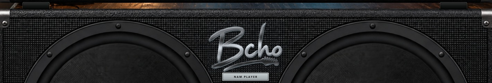

Los dos conos reaccionan al RMS real de la salida final: tocar más fuerte, o
subir MASTER VOL / OUTPUT GAIN, da mayor excursión; el silencio y POWER apagado
los devuelven suavemente al reposo. Solo se mueve la superficie de los conos:
aros, tornillos, rejilla, mueble y logotipo permanecen fijos. La animación va a
60 fotogramas por segundo en el hilo de interfaz y nunca toca, retrasa ni
realimenta el audio.

---

## 21. Referencia de ratón y teclado

| Dónde | Acción | Resultado |
| --- | --- | --- |
| Cualquier mando | Arrastrar arriba/abajo o izquierda/derecha | Cambia el valor |
| Cualquier mando | Doble clic | Restaura el valor por defecto (GATE vuelve a OFF) |
| Bloque del rack | Clic simple | Activa / bypass |
| Bloque del rack | Doble clic | Abre su editor o su selector de archivo |
| Bloque del rack | Arrastrar en horizontal | Reordena (BLOCK NAM 2 e IR son fijos) |
| Bloque del rack | Soltar un archivo o carpeta | Lo carga en ese bloque |
| Icono de ojo | Clic | Visualiza ese bloque con los controles compartidos |
| Icono de cadena | Clic | Enlaza / desenlaza ese efecto entre L y R |
| Lista NAM o IR | Clic en una fila | La carga |
| Lista IR | Clic otra vez en la fila seleccionada | Deselecciona: borra la respuesta y pone el bloque IR en bypass |
| Lista NAM o IR | Soltar un archivo o carpeta | Lo carga |
| ▲ / ▼ | Clic | Entrada anterior / siguiente de la lista |
| Ventana de diálogo | `Esc` | Cerrar |
| Cualquier control | Pasar el ratón | Muestra su ayuda |

---

## 22. Resolución de problemas

| Síntoma | Qué comprobar |
| --- | --- |
| DI en silencio | Pulsa PLAY: volver desde IN no reanuda automáticamente. Comprueba archivo, nivel y posición al final de pista |
| Archivo DI rechazado | Cada pista debe ser WAV, AIFF o FLAC mono; exporta cada canal por separado desde el DAW |
| No suena nada | POWER encendido; la ruta MAIN apunta a las salidas que escuchas; el canal de entrada correcto está marcado en Audio Setup; el vúmetro de entrada se mueve al tocar |
| Suena, pero sin amplificador | Hay una captura cargada y BLOCK NAM 2 está encendido; la cadena no está entera en bypass (una cadena en bypass deja pasar el sonido seco) |
| Un bloque NAM no se enciende | Carga una captura válida en ese bloque y espera a que termine; una captura válida lo activa sola |
| El bloque IR sigue en bypass | Carga una respuesta válida y comprueba que no has pulsado dos veces la fila seleccionada (eso la deselecciona) |
| Chasquidos o cortes al tocar | Sube el búfer de audio, usa el driver ASIO del fabricante en Windows y evita búferes muy pequeños con varios bloques NAM activos, especialmente PLUS en paralelo |
| Una carpeta aparece vacía | Debe contener archivos `.nam`, o respuestas `.wav` cortas y válidas, directamente dentro de la carpeta, salvo que marques DEEP SEARCH |
| El nivel no coincide con otro software NAM | Revisa la referencia de interfaz en Audio Setup y si Input Cali está activo |
| Una captura suena demasiado alta o baja | Revisa IR VOL (-12 dB por defecto) e Input Cali antes de tocar INPUT GAIN |
| La sesión no volvió | El reproductor guarda al cerrar con **normalidad**; tras un cierre forzado se restaura la sesión anterior |
| Faltan modelos o IR | Se referencian por ruta de disco. Devuélvelos a su sitio o carga un preset `.bnpp`, que los incrusta |
| La lista de TONE3000 está vacía | Revisa la cuenta, la red y, en Windows, WebView2; o usa el navegador externo |
| macOS rechaza el primer arranque | Clic derecho en la aplicación y elige **Abrir** |
| El AppImage de Linux no arranca | Dale permiso con `chmod +x` y confirma que el sistema tiene una pila de audio x86_64 funcional |

---

## 23. Especificaciones técnicas

| Elemento | Valor |
| --- | --- |
| Rutas de señal | 2 independientes (L / R) |
| Bloques NAM | NORMAL: 2 por ruta. PLUS: 2 por línea y 2 líneas por ruta (hasta 8 entre L/R) |
| IR de pantalla | 1 IR general por ruta; PLUS añade hasta 2 por línea (4 por ruta) |
| Reproductor DI | Solo standalone; 1 archivo mono compartido o 2 en SPLIT; WAV / AIFF / FLAC, remuestreo automático |
| Efectos | 8 por ruta, con 3 algoritmos y 6 parámetros cada uno |
| Posiciones del rack | NORMAL: 11. PLUS sustituye los dos NAM por un bloque NAM / IR doble en NAM 1; el IR general sigue separado |
| Arquitecturas NAM | A1, A2 Standard, A2 Nano, detectadas automáticamente |
| Frecuencias de muestreo | Las que ofrezca el dispositivo, de 44,1 a 192 kHz |
| Tamaño de búfer | El que ofrezca el driver; el motor usa internamente 32 muestras como mínimo y divide los búferes excesivos |
| Longitud de IR | Hasta 8192 muestras, remuestreadas a la frecuencia del dispositivo, nunca normalizadas |
| Rango del afinador | ~65 - 700 Hz, centrado a ±5 cents |
| Rango de Auto Cal | -24 … +24 dB |
| Fundido de arranque | 60 ms desde silencio |
| Fundido al cambiar de NAM | 15 ms de salida, silencio hasta instalar la captura nueva, 20 ms de entrada (coseno elevado) |
| Fundido al cambiar de IR | 12 ms de fundido cruzado |
| Ventana nativa | 1537 x 1023, adaptable, mínimo 50 % |
| Refresco de interfaz | 60 fps, íntegramente fuera del hilo de audio |

---

## 24. Integridad, código de terceros y licencias

Compara los hashes de los ZIP descargados con `SHA256SUMS.txt`. Bcho NAM Player
incluye JUCE y Neural Amp Modeler Core; sus avisos están en
`THIRD_PARTY_NOTICES.md`.

La aplicación no otorga derechos sobre capturas NAM ni respuestas impulsionales
de terceros. Respeta la licencia que acompaña a cada captura o respuesta, incluso
las que descargues por TONE3000 o compartas dentro de un preset `.bnpp`.
